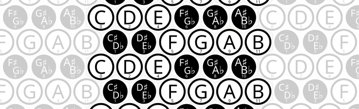

# Isomorphic Musical Keyboards

## Note layouts where relative physical position matches relative pitch.

If the ratio of frequencies between two notes is a power of two, then the notes sound very similar, 
and in musical notation, are labelled with the same letter. 
220hz, 440hz, 880hz - these are all "A" notes.
The interval between one frequency and its double is called an "octave".

In Twelve-tone Equal Temperament, the most common musical system today,
each octave is split up into 12 logarithmically spaced intervals.
Each note has a frequency 2^(1/12) times the previous note.
This interval is also called a "semitone".

A standard piano keyboard is arranged so that 
moving 1 key to the right increases the pitch by 1 semitone.
Moving 12 keys to the right increases the pitch by 1 octave.

But the keys on a piano aren't a consistent size. 
7 of the notes - the ones important enough in Western music to get their own letter name -
are given their own big white keys,
while the other 5 keys in each octave are given shrunken-down black keys.
One of the consequences of this layout is that 
if you want to change the key of a song (shift every note by the same frequency), 
you can't simply move the position of your hands on the keyboard;
you need to change the pattern that your fingers move in as well.

An *isomorphic* keyboard is one that doesn't have this particular problem.
Songs, chords, and intervals have the same shape, even when the key is changed.

---


## Linear Isomorphic Keyboard

Making a 1-dimensional isomorphic keyboard is simple.
Just take a piano and make all the keys the same shape.

At least one firm has tried to manufacture [a keyboard in this style](https://www.youtube.com/watch?v=hqbOqGRCAt0).

I've also found [this video of a **Ten**-tone equal temperament isomorphic keyboard](https://www.youtube.com/watch?v=LxeGZLd49Vs).
One commenter describes its sound as perfect for a "klingon opera".


---

## Hexagonal Isomorphic Keyboards.

There are a number of ways to arrange notes on a hexagonal grid in an isomorphic way.

Each possible isomorphic layout can be specified by a pair (α,β)
which describes the shift in semitones when moving in each direction.


Ignoring rotations, reflections, and translations, 
and limiting the shift between adjacent notes to no more than an octave,
we only need to consider the 49 cases where 
α is between 0 and 12 inclusive, β is between 0 and α inclusive,
and α+β is no more than 12.[^detailsaboutmorerestrictiveset]

[^detailsaboutmorerestrictiveset]: If a further restriction is imposed to treat layouts as equivalent if individual notes are shifted by an octave - treating the space of notes as the integers modulo 12 - then there are 19 distinct layouts, 10 of which cover all 12 notes. However, this set would treat sets like {(4,3), (5,4), (4,3)} as equivalent note layouts, which feels silly to me.


Of these 49 possibilities, only 24 cover all 12 notes.
The other 25 possibilities are missing notes.
For example, you could make a keyboard with (0,0) semitone shifts,
but thats only useful if you [only want to play E](https://www.youtube.com/watch?v=BFetTcrVWII).


<!--
validOctaveRangePairs = {
 (1, 0), (1, 1), 
 (2, 1), 
 (3, 1), (3, 2),
 (4, 1),
 (4, 3),
 (5, 1), (5, 2), (5, 3), (5, 4),
 (6, 1), (6, 5),
 (7, 1), (7, 2), (7, 3),
 (7, 4), (7, 5),
 (8, 1), (8, 3), 
 (9, 1), (9, 2),
 (10, 1),
 (11, 1)}


-->


### (1,1) The Janko Keyboard



[Invented in 1882 by Paul von Jankó](http://improvise.free.fr/janko.htm), 
this keyboard layout is similar to a 1-dimensional isomorphic keyboard,
but with multiple copies of the keyboard stacked above one another.

Because of its mechanical similarity to a standard piano,
there are several firms which have manufactured instruments with this layout.
[Here's a video of a player demonstrating such a piano](https://www.youtube.com/watch?v=cK4REjqGc9w&t=248s).
[And here's another](https://www.youtube.com/watch?v=FkN9-r7q7gg). [One more](https://www.youtube.com/watch?v=oT2zkss77Fo).
There are also [3d-printed overlays](https://www.youtube.com/watch?v=9tMtKyYEbaM) 
that can be dropped on top of a standard piano keyboard to convert it to a janky Janko layout.

[Here's another demonstration of the Janko layout on a programmable midi keyboard](https://www.youtube.com/watch?v=mVSG2KPOuME). 
This video calls the layout the "Bosanquet-Wilson Layout", though it has the same relationship between keys as a Janko layout.

<!--Another 3d printed version https://hackaday.com/2019/07/13/isomorphic-keyboards-with-cv-out/-->


### (2,1) Chromatic Button Accordion 

Many accordions have a piano-style keyboard for playing melodies.
But another common layout for accordions is a hexagonal grid of keys in this layout.
These are called chromatic button accordions, 
and there are two variants called called type B and type C, which are mirror images of each other.
The bass-side of such accordions may or may not
have  a similarly isomorphic key layout.
<!--but sometimes it has a more complicated layout called the Stradella system.-->

Examples of people playing such accordions:
[1](https://www.youtube.com/watch?v=u6Bu3qOURQ8),
[2](https://www.youtube.com/watch?v=WLIxmdOEd0c),
[3](https://www.youtube.com/watch?v=SzA8O-aTOTQ),
[4](https://www.youtube.com/watch?v=9XiilKWrWGQ),
[5](https://www.youtube.com/watch?v=ZUGKB2RdzjU),

<!--
Stradella on other side is some complicated system where most of the notes are chords.
Free-bass system looks like an isomorphic layout.

https://www.youtube.com/watch?v=6MwrKj2oftM

Electronic keyboard with this layout:
https://www.youtube.com/watch?v=5O1ei95NhYs
https://www.youtube.com/watch?v=2UJ-0nkIYMg
https://www.youtube.com/watch?v=BBn8hxDnHAc
Explanation Video:
https://www.youtube.com/watch?v=krtviJeloFs
-->


### (3,1) Qwerty Chromatic Columns


I don't know if there are any actual instruments with these layouts,
but [my toy qwerty piano web app](https://www.rmwinslow.com/tones/) implements a version of (3,1), labelled "Isomorphic - Columns".

On a Qwerty keyboard, there are 4 rows, 
and so (if rotated properly) these layouts allow an octave to be covered by three consecutive columns.
<!--(The (1,4) layout would need to be rotated so that the 4-semitone shift happens horizontally.)-->
<!---
Looks like this app has a (3,1) layout
https://www.youtube.com/watch?v=2mmzoWftiLM
And there's a crackpot in the comment section complaining about his patents.
It looks like these are it here:
https://patents.google.com/patent/US5741990A/
"Method of and means for producing musical note relationships"
No idea how the patent office approved such a stupendously vague and conceptually basic patent. 
-->

*Edit: Brett Park and David Gerhard, in their *Musix Pro* app call the (3,1) note layout the "Gerhard" layout, and [demonstrate it here](https://shiverware.com/musixpro/gerhard/chords.html).*


#### Other (n,1) layouts.

The (4,1) layout can similarly be used to fit an octave into three columns and four rows.

(11, 1) would be like a stack of 1-d keyboards where each row is one octave apart.

(5,1), (6,1), (7,1), (8,1), (9,1), and (10,1) are similarly stacked keyboards, though ones of more dubious usefulness.
The (5,1) and (6,1) layout might be handy if one wanted to cram an octave into a 2 row by 6 column space.
I haven't played around with them, but they might have nice properties.


### (3,2) 

(3,2) is called the "Park" layout by Brett Park in his Musix app. 
[Here is a video of a song being played using this layout](https://www.youtube.com/watch?v=3ZDyIkeIgU0).


<!--
http://www.altkeyboards.com/instruments/isomorphic-keyboards
-->


### (5,2) Wicki-Hayden

It seems that accordion makers love to experiment with alternate layouts.

In addition to the (2,1) Chromatic Button Accordion layout, 
(and many different non-isomorphic key layouts) <!--Including some where the note depends on which direction the bellows is moving.-->
some accordion-type instruments use what's called the Wicki-Hayden layout,
which is so-named because it was independently invented by Kaspar Wicki and Brian Hayden.

<!--
https://www.concertina.net/forums/index.php?/topic/24168-jeffries-layout-call-me-confused/
https://www.concertina.net/forums/index.php?/topic/21248-help-with-a-video-game-song-arrangement/#comment-197305
-->


<!--Both people invented it for use in accordion-type instruments -
Wicki for the bandoneon and Hayden for the concertina -->
<!--- 
so it seems that accordion players are very mathematically-minded folk.-->
<!--Proper term is squeezeboxes?-->

<!--As far as I can tell, however, most bandoneons and concertinas don't use this layout.
Modern "duet concertinas" are the instruments most likely to have this layout.-->

As far as I can tell, the instruments with this layout are most commonly called "Hayden duet concertinas".

Examples of play: 
[1](https://www.youtube.com/watch?v=P-GBN56YJV4),
[2](https://www.youtube.com/watch?v=vUbIYM0RNiw),
[3](https://www.youtube.com/watch?v=pDaYYWl-gus),
[4](https://www.youtube.com/watch?v=8z_a-1HreuY),
[5](https://www.youtube.com/watch?v=A0YKZsue4Zo)
[6](https://www.youtube.com/watch?v=RDVrHqQkMC0).


[My toy qwerty piano web app](https://www.rmwinslow.com/tones/) has a (5,2) layout, labelled "Isomorphic - Wicki".


### (4,3) Euler's Tonnetz

<aside>

</aside>


The Tonnetz, or Tone Network is a hexagonal grid of notes 
where 
each triplet of three adjacent notes forms a musically-significant chord.

The tonnetz was first described by Leonard Euler in 1739.
The modernized version with 12-tone equal temperament is also sometimes called a "Harmonic Table" layout.

There have been several instruments built using this keyboard layout,
including the [Harmonetta, which is like a big harmonica with a keyboard attached](https://www.youtube.com/watch?v=UyZ1beUJ4zw),
and [various](https://www.youtube.com/watch?v=yK88yT7U39U) [electronic](https://www.youtube.com/watch?v=C9-OSCl7kOc) [keyboard](https://steve-boyer-design.com/trichord-2001/) [projects](https://www.youtube.com/watch?v=AklKy2NDpqs&t=15s).


<!--
http://www.skyboy.com/trichord.html
http://shapeofmusic.com/note-pattern.php
-->

[Here's a web app where you can play around with the Tonnetz](https://cifkao.github.io/tonnetz-viz/).
And [my toy qwerty piano web app](https://www.rmwinslow.com/tones/) also has a Tonnetz layout, labelled "Isomorphic - Euler".


<!--
 (1, 0), trivial
 (1, 1), Janko
 (2, 1), Chromatic Button Accordian
 (3, 1), Qwerty columns
 (3, 2), Park
 (4, 1), Qwerty columns
 (4, 3), Tonnetz
 (5, 1), meh
 (5, 2), Wicki Hayden
 (5, 3), 
 (5, 4),
 (6, 1), meh
 (6, 5),
 (7, 1), meh
 (7, 2), 
 (7, 3),
 (7, 4), 
 (7, 5),
 (8, 1), meh
 (8, 3), 
 (9, 1), meh
 (9, 2),
 (10, 1),
 (11, 1) octave offset
 }
-->

---

### Other Possibilities not described above.

(0,1) would be completely equivalent to a 1-d keyboard. 


Here's the full set of pairs which give distinct layouts:

<!--
```
(1, 0), (1, 1), 
(2, 1), 
(3, 1), (3, 2),
(4, 1), (4, 3), 
(5, 1), (5, 2), (5, 3), (5, 4),
(6, 1), (6, 5),
(7, 1), (7, 2), (7, 3), (7, 4), (7, 5),
(8, 1), (8, 3), 
(9, 1), (9, 2),
(10, 1),
(11, 1) 
```
-->
```
(1, 0), 
(1, 1), (2, 1), (3, 1), (4, 1), (5, 1), (6, 1), (7, 1), (8, 1), (9, 1), (10, 1), (11, 1) 
(3, 2), (5, 2), (7, 2), (9, 2),
(4, 3), (5, 3), (7, 3), (8, 3),
(5, 4), (7, 4),
(6, 5), (7, 5),
```


<!--EFG = 457 are nice adjacent intervals. also eflat=3-->


---

## Rectangular Isomorphic Keyboards.

Rectangular isomorphic keyboards can be mapped 1-1 to hexagonal isomorphic keyboards.
There are also 28 distinct rectangular isomorphic keyboards, 15 of which cover all 12 notes.
<!--The rectangular layouts can also be described with a pair (x,y) where-->

I won't list all the possibilities here.


###  The Harpeji <!--(1,2)-->

The harpeji is a string instrument played by tapping on frets.

Moving horizontally between strings shifts the pitch by two semitones,
and moving between frets shifts the pitch by one semitone.

Here are a few examples of people playing the harpeji:
[1](https://www.youtube.com/watch?v=LQtEElCV2lY&t=17s),
[2](https://www.youtube.com/watch?v=NWUYXQMwIk4),
[3](https://www.youtube.com/watch?v=DAvAC1EZUYQ),
[4](https://www.youtube.com/watch?v=eJ3H0Njb1As)

### String instruments in general

The harpeji is designed to be played in a 'keyboard' style,
but many other string instruments also have equal intervals between each string and between each fret.
So they have similar properties to an isomorphic keyboard.

Not guitars though. For some reason, guitars have intervals of 5 semitones between strings,
except for one pair of strings, where the interval is only 4 semitones.

<!--
 (4:5:6 frequency ratio)
and there are also [diy projects](http://www.balanced-keyboard.com/) 
which try to retrofit a standard piano keyboard into a more isomorphic design.

https://en.wikipedia.org/wiki/Zhu_Zaiyu
Bizarre coincidence of history
exact calculation of twelve-tone equal temperament are Zhu Zaiyu (also romanized as Chu-Tsaiyu. Chinese: 朱載堉) in 1584 and Simon Stevin in 1585
wiskunde - dutch word for math, lit meaning art of what is known/ knowledge of what is certain

http://squeezehead.com/uniform-keyboard/
http://improvise.free.fr/
http://improvise.free.fr/altinst.htm
https://daskin.com/index.html
https://daskin.com/page5/page5.html
https://isomorphickeyboardoverlay.weebly.com/
http://www.dysartp.com/
http://musicnotation.org/wiki/instruments/janko-keyboard/
http://musicnotation.org/wiki/instruments/6-6-colored-traditional-7-5-keyboard/
https://en.xen.wiki/w/Microtonal_keyboards
https://bikexprt.com/music/bosanqet.htm

trichromatic vibraphone:
https://www.youtube.com/watch?v=sGXmPzspJWI

TODO: This web applet describes something called the MIDI api.
I don't have anything that hooks up to this,
but if I get a hold of such 
https://cifkao.github.io/tonnetz-viz/

Isomorphic keyboard on QWERTY
https://www.youtube.com/watch?v=2kxLhwZb7P8

Terpstra Keyboard Concept
https://www.youtube.com/watch?v=Nb_TQpwam54
Later rebranded as lumatone, I think.

Russian guy playing on qwerty janko
https://www.youtube.com/watch?v=myF39OL3rYA
https://www.youtube.com/watch?v=t-TBD2vhSd4
https://novayashkola.org/janko/keys.htm?
https://github.com/wcgbg/terpstrakeyboard/
-->


---