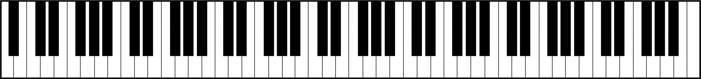

While putting together a [toy musical qwerty-piano applet](rmwinslow.com/tones), 
I did a lot of thinking about how to best arrange musical notes on a Qwerty keyboard.
Computer keyboards offset their rows, 
which means that the keys can be thought of as a hexagonal grid.
To that end, this page enumerates the ways to place musical notes into a hexagonal grid,
such that the resulting grid is *isomorphic*, which in this context means that the musical interval between adjacent keys is consistent across the grid.

After taking into account a few constraints and equivalencies, there are only 10 distinct types of isomorphic hexagonal musical keyboards. Where possible, I've included examples of instruments which use each layout.

<!--Don't worry; 
This isn't just a list of mathematical vectors.
I've also included plenty of links to videos of people playing strange instruments which illustrate these layouts.-->


<!--
permalink: isomorphic
https://www.youtube.com/watch?v=VswBvmpnS1c
https://www.youtube.com/watch?v=khlHjHiBRp8
https://www.youtube.com/watch?v=ZMRUm_CoW-I&list=PLJ0GZCv6QiN53IwxrazwKhF2Fk8Ve85uz
https://www.youtube.com/watch?v=NyfQ1xPn7hg Gadgetina
-->

## Some Brief and Simplified Musical Theory

If the ratio of frequencies between two notes is a power of two, then the notes sound very similar, 
and in musical notation, are labelled with the same letter. 
220hz, 440hz, 880hz - these are all "A" notes.
The interval between one frequency and its double is called an "octave".

In Twelve-tone Equal Temperament, the most common musical system today,
each octave is split up into 12 logarithmically equal intervals.
Each note has a frequency 2^(1/12) times the previous note.
This interval is also called a "semitone".

A standard piano keyboard is arranged so that 
moving 1 key to the right increases the pitch by 1 semitone.
Moving 12 keys to the right increases the pitch by 1 octave.



But the keys on a piano aren't a consistent size. 
7 of the notes - the ones important enough in Western music to get their own letter name -
are given their own big white keys,
while the other 5 keys in each octave are given shrunken-down black keys.
One of the consequences of this layout is that 
if you want to change the key of a song (shift every note by the same frequency), 
you can't simply move the position of your hands on the keyboard;
you need to change the pattern that your fingers move in as well.

An *isomorphic* keyboard is one that doesn't have this particular problem.
Songs, chords, and intervals have the same shape, even when the key is changed.

---


## Linear Isomorphic Keyboard

Making a one-dimensional isomorphic keyboard is simple.
Just take a piano and make all the keys the same shape.

At least one firm has tried to manufacture [a keyboard in this style](https://www.youtube.com/watch?v=hqbOqGRCAt0).
There's also [this video of a **Ten**-tone equal temperament isomorphic keyboard](https://www.youtube.com/watch?v=LxeGZLd49Vs).
One commenter describes its sound as perfect for a "klingon opera".


---

## Hexagonal Isomorphic Keyboards.

Moving to a two-dimensional keyboard greatly increases the number of possibilities.
At first, it may seem like there are two many potential layouts to count, 
but by imposing a few constraints, 
we can narrow things down to a reasonable small number of distint layouts.

First, let's restrict to our attentions to a hexagonal grid, as found on a computer keyboard.
Each possible isomorphic layout can be specified by a pair (α,β)
which describes the shift in semitones when moving in each direction.

<div markdown="block" style="text-align: center;">

</div>

Ignoring rotations, reflections, and translations, 
and limiting the shift between adjacent notes to no more than an octave,
we only need to consider the 49 cases where 
α is between 0 and 12 inclusive, β is between 0 and α inclusive,
and α+β is no more than 12.

Of these 49 possibilities, only 24 cover all 12 notes.
The other 25 possibilities are missing notes.
For example, you could make a keyboard with (0,0) semitone shifts,
but thats only useful if you [only want to play E](https://www.youtube.com/watch?v=BFetTcrVWII).

If a further restriction is imposed to treat layouts as equivalent if individual notes are shifted by an octave - treating the space of notes as the integers modulo 12 - then there are 19 distinct layouts, only 10 of which cover all 12 notes. 
These 10 groups of layouts are illustrated below. 
I've used the term "doppelganger" to refer to keyboard layouts which are equivalent only when octave shifts are ignored.
Such sets of "doppelganger" layouts would feel very different to play, but I've grouped them together to keep this list manageable.


<!--
TODO: Another page with the details.
The pair either needs to have a 1, or the pair needs to be coprime modulo 12.
TODO: Maybe put a full summary of the enumeration in here?
Click the above box to open a summarized list of the set of 24 "full" isomorphic keyboards.

Below, I've highlighted the layouts that are musically notable, and created visualizations of their 
note grids.
-->

In each image, the opaque circles represent the notes from a single octave (notes show up multiple times in each grid). The translucent circles are the notes from other octaves. 
In some cases, the grids are rotated so that an octave's worth of notes fits nicely into a horizontal banner image.


---

### (1,1) The Janko Keyboard

 isomorphic note layout, as found on Janko-style pianos.")

[Invented in 1882 by Paul von Jankó](http://improvise.free.fr/janko.htm), 
this keyboard layout is similar to a 1-dimensional isomorphic keyboard,
but with multiple copies of the keyboard stacked above one another.

Because of its mechanical similarity to a standard piano,
there are several firms which have manufactured instruments with this layout.
[Here's a video of a player demonstrating such a piano](https://www.youtube.com/watch?v=cK4REjqGc9w&t=248s).
[And here's another](https://www.youtube.com/watch?v=FkN9-r7q7gg). [One more](https://www.youtube.com/watch?v=oT2zkss77Fo).
There are also [3d-printed overlays](https://www.youtube.com/watch?v=9tMtKyYEbaM) 
that can be dropped on top of a standard piano keyboard to convert it to a janky Janko layout.

[Here's another demonstration of the Janko layout on a programmable midi keyboard](https://www.youtube.com/watch?v=mVSG2KPOuME). 
This video calls the layout the "Bosanquet-Wilson Layout", though it has the same relationship between keys as a Janko layout.

<!--Another 3d printed version https://hackaday.com/2019/07/13/isomorphic-keyboards-with-cv-out/-->

<details markdown="block">
<summary>Doppelganger: (10,1)</summary>
 isomorphic note layout.")
</details>

<!--
The Musix app guys also call this the Gerhard layout. They also refer to the (2,1) layout as Gerhard?
-->

---


### (2,1) Chromatic Button Accordion 


 isomorphic note layout, as found on chromatic button accordions.")

There are many, *many* different designs for the layout of keys on an accordion, but this is a fairly common one.

On *chromatic button accordions*, the melody side of the instrument has keys laid out in an (2,1)isomorphic hexagonal grid, 
with an interval of 2, 1, or 3 semitones between adjacent keys. 
There are two variants called called type B and type C, which are mirror images of each other.
The bass-side of such accordions may or may not
have  a similarly isomorphic key layout.
<!--but sometimes it has a more complicated layout called the Stradella system.-->

Examples of people playing such accordions:
[1](https://www.youtube.com/watch?v=u6Bu3qOURQ8),
[2](https://www.youtube.com/watch?v=WLIxmdOEd0c),
[3](https://www.youtube.com/watch?v=SzA8O-aTOTQ),
[4](https://www.youtube.com/watch?v=9XiilKWrWGQ),
[5](https://www.youtube.com/watch?v=ZUGKB2RdzjU),

[My toy qwerty piano web app](https://www.rmwinslow.com/tones/) implements a version of (2,1), labelled "Isomorphic - CB Accordion".
And take a look at [Linus Åkesson's Commodordion](https://www.youtube.com/watch?v=EBCYvoC4muc), a chromatic button accordion made from two Commodore 64 computers.

<!--
Stradella on other side is some complicated system where most of the notes are chords.
Free-bass system looks like an isomorphic layout.

https://www.youtube.com/watch?v=6MwrKj2oftM

Electronic keyboard with this layout:
https://www.youtube.com/watch?v=5O1ei95NhYs
https://www.youtube.com/watch?v=2UJ-0nkIYMg
https://www.youtube.com/watch?v=BBn8hxDnHAc
Explanation Video:
https://www.youtube.com/watch?v=krtviJeloFs
-->


<details markdown="block">
<summary>Doppelgangers: (9,1), (9,2)</summary>
 isomorphic note layout.")
 isomorphic note layout.")
</details>

---


### (3,1) Qwerty Chromatic Columns / Gerhard / Wheatstone Double

 isomorphic note layout.")


I don't know if there are any actual instruments with these layouts,
but [my toy qwerty piano web app](https://www.rmwinslow.com/tones/) implements a version of (3,1), labelled "Isomorphic - Columns".

I call it such because 
on a Qwerty keyboard, there are 4 rows, 
and so (if rotated properly) a (3,1) layout allows an octave to be covered by three consecutive columns of keys.
<!--(The (1,4) layout would need to be rotated so that the 4-semitone shift happens horizontally.)-->
<!---
Looks like this app has a (3,1) layout
https://www.youtube.com/watch?v=2mmzoWftiLM
And there's a crackpot in the comment section complaining about his patents.
It looks like these are it here:
https://patents.google.com/patent/US5741990A/
"Method of and means for producing musical note relationships"
Man, this guy uses a ton of words to say "a hexagonal keyboard layout where each row is a chromatic scale offset by 4 semitones from the row below it." 
Are all patents this pointlessly wordy? 
-->

Brett Park and David Gerhard, in their* Musix Pro *app call the (3,1) note layout the "Gerhard" layout, and [demonstrate it here](https://shiverware.com/musixpro/gerhard/chords.html).

There were also concertinas manufactured in the 1800s with the layout, [here called Wheatstone Double Duet concertinas](http://www.concertina.com/double/). Alas, I am unable to find an example video of such an instrument being played. Wheatstone still manufactures accordions, but other, non-isomorphic, layouts seem to be more common. [Here are some pictures, though](http://www.rowlhouse.co.uk/concertina/double/).

<!--https://www.eatmt.org.uk/the-english-concertina/-->

<details markdown="block">
<summary>Doppelgangers: (8,1), (8,3)</summary>
 isomorphic note layout.")
 isomorphic note layout.")
</details>


---


### (4,1)


 isomorphic note layout.")

<details markdown="block">
<summary>Doppelgangers: (7,1), (7,4)</summary>
 isomorphic note layout.")
 isomorphic note layout.")

The (7,4) layout is wonky looking and will break your fingers if you try to use it to play scales,
but the fingering on major chords and minor chords actually feels quite reasonable.

</details>


---


### (5,1)


 isomorphic note layout.")

<details markdown="block">
<summary>Doppelgangers: (6,1), (6,5)</summary>
 isomorphic note layout.")
 isomorphic note layout.")
</details>

---

### (11,1) Stacked Keyboards


 isomorphic note layout.")

All of the (n,1) layouts can be thought of as a series of 1-dimensional keyboards, stacked atop each other and offset by some amount.

At one extreme, there is the (11, 1) layout, depicted above, 
where each row is one octave apart. 
A bit unwieldy, but not entirely strange for an instrument to have.[^octaveshiftkeyboard]

[^octaveshiftkeyboard]: I could have sworn that I've seen actual musical instruments with something like an (11,1) layout, with multiple standard piano keyboards literally stacked atop each other. But I am unable to find examples of such a thing, so perhaps I just imagined it.

<details markdown="block">
<summary>Doppelganger: (1,0)</summary>
 isomorphic note layout, which is essentially just a normal keyboard.")
</details>

At the other extreme, there's the (0,1) keyboard, which would essentially just be a 1-dimensional keyboard with oddly shaped keys. 

---


<!--
### Other (n,1) layouts.


I was under the impression that this was the purpose of a pipe organ's multiple keyboards, but I was mistaken about that.


The (4,1) layout could, like the (3,1) layout, be used to fit an octave into a three column by four row space, though the columns would be slanted differently. 
Likewise, the (5,1) and (6,1) layouts might be handy if one wanted to cram an octave into a 2 by 6 space. 

(7,1), (8,1), (9,1), and (10,1) are similarly stacked keyboards, though ones for which no immediate use-case comes to my mind. 

I haven't played around with them, however, so they might have nice properties.-->


### (3,2) Park

 isomorphic note layout.")

Brett Park and David Gerhard, in their *Musix Pro* app call the (3,1) note layout the "Park" layout, and [demonstrate it here](https://shiverware.com/musixpro/park/chords.html). 


I haven't found any other examples of this note layout in use.


<!--
Though I do like the the relative positions of the white keys here.

[Here is a video of a song being played using this layout](https://www.youtube.com/watch?v=3ZDyIkeIgU0).-->

<!--
http://www.altkeyboards.com/instruments/isomorphic-keyboards
-->

<details markdown="block">
<summary>Doppelgangers: (7,2), (7,3)</summary>
 isomorphic note layout.")
 isomorphic note layout.")

(7,3) is similar to (7,4) in that the layout looks like a mess, but the common triad chords seem easy to play.
</details>


---


### (5,2) Wicki-Hayden


 isomorphic note layout.")

It seems that accordion makers love to experiment with alternate layouts.
<!--The (2,1) Chromatic Button Accordion layout was discussed above.-->
A couple have been mentioned already.
There are also accordions with a (5,2) layout,
most commonly called "Hayden Duet Concertinas".
The layout itself is called the Wicki-Hayden layout,
because it was independently invented by Kaspar Wicki and Brian Hayden.

<!--TODO: Attribution to Wicki and Hayden. Explanation of "duet" in name.-->


<!--
In addition to the (2,1) Chromatic Button Accordion layout, 
(and many different non-isomorphic key layouts) Including some where the note depends on which direction the bellows is moving.
some accordion-type instruments use what's called the Wicki-Hayden layout,
which is so-named because it was independently invented by Kaspar Wicki and Brian Hayden.
-->

<!--
https://www.concertina.net/forums/index.php?/topic/24168-jeffries-layout-call-me-confused/
https://www.concertina.net/forums/index.php?/topic/21248-help-with-a-video-game-song-arrangement/#comment-197305
-->


<!--Both people invented it for use in accordion-type instruments -
Wicki for the bandoneon and Hayden for the concertina -->
<!--- 
so it seems that accordion players are very mathematically-minded folk.-->
<!--Proper term is squeezeboxes?-->

<!--As far as I can tell, however, most bandoneons and concertinas don't use this layout.
Modern "duet concertinas" are the instruments most likely to have this layout.

https://www.youtube.com/watch?v=djQCJqOSA-U
-->

Examples of play: 
[1](https://www.youtube.com/watch?v=P-GBN56YJV4),
[2](https://www.youtube.com/watch?v=vUbIYM0RNiw),
[3](https://www.youtube.com/watch?v=pDaYYWl-gus),
[4](https://www.youtube.com/watch?v=8z_a-1HreuY),
[5](https://www.youtube.com/watch?v=A0YKZsue4Zo)
[6](https://www.youtube.com/watch?v=RDVrHqQkMC0).

Here's [a synthesizer designed to make use of the Wicki-Hayden layout](https://www.youtube.com/watch?v=v-SpIecfIZ0), which the creators calls a "Melodicade".

This is my current favorite layout.
[My toy qwerty piano web app](https://www.rmwinslow.com/tones/) has a (5,2) layout, labelled "Isomorphic - Wicki".


(No Dopplegangers.)

---


### (4,3) Euler's Tonnetz

 isomorphic note layout, similar to the Euler's Tonnetz.")

The Tonnetz, or Tone Network is a hexagonal grid of notes 
where 
each triplet of three adjacent notes forms a musically-significant chord.

The tonnetz was first described by Leonard Euler in 1739.
The modernized version with 12-tone equal temperament is also sometimes called a "Harmonic Table" layout.

There have been several instruments built using this keyboard layout,
including the [Harmonetta, which is like a big harmonica with a keyboard attached](https://www.youtube.com/watch?v=UyZ1beUJ4zw),
and [various](https://www.youtube.com/watch?v=yK88yT7U39U) [electronic](https://www.youtube.com/watch?v=C9-OSCl7kOc) [keyboard](https://steve-boyer-design.com/trichord-2001/) [projects](https://www.youtube.com/watch?v=AklKy2NDpqs&t=15s).


<!--
http://www.skyboy.com/trichord.html
http://shapeofmusic.com/note-pattern.php
-->

[Here's a web app where you can play around with the Tonnetz](https://cifkao.github.io/tonnetz-viz/).
And [my toy qwerty piano web app](https://www.rmwinslow.com/tones/) also has a Tonnetz layout, labelled "Isomorphic - Euler".


<!--
http://www.altkeyboards.com/instruments/isomorphic-keyboards/jim-plamondon-isomorphics
http://www.quadibloc.com/other/mus03.htm
-->


<details markdown="block">
<summary>Dopplegangers: (5,3) and (5,4)</summary>
 isomorphic note layout, similar to the Euler's Tonnetz.")
 isomorphic note layout, similar to the Euler's Tonnetz.")
</details>


---


### (7,5) Drunken Circle of Fifths

 isomorphic note layout.")

This layout is interesting. 7+5=12, and as the result, one axis shifts the notes by an entire octave. 
At the same time, the notes within an octave meander back and forth, 
moving through the circle of fifths in a zigzag pattern.

I don't know of any actual instruments with this layout.
<!--Though some accordions do have chord buttons, which are arranged according the the circle of fifths.-->


(No Dopplegangers.)


---


<!--

{(0, 0, 1, 1, 11, 11): [(11, 1), (1, 0)],
 (1, 2, 3, 9, 10, 11): [(2, 1), (9, 2), (9, 1)],
 (3, 4, 5, 7, 8, 9): [(4, 3), (5, 4), (5, 3)],
 (1, 3, 4, 8, 9, 11): [(3, 1), (8, 3), (8, 1)],
 (1, 5, 6, 6, 7, 11): [(6, 1), (5, 1), (6, 5)],
 (2, 3, 5, 7, 9, 10): [(7, 3), (3, 2), (7, 2)],
 (1, 4, 5, 7, 8, 11): [(4, 1), (7, 4), (7, 1)],
 (2, 5, 5, 7, 7, 10): [(5, 2)],
 (1, 1, 2, 10, 11, 11): [(1, 1), (10, 1)],
 (0, 0, 5, 5, 7, 7): [(7, 5)]}


### Other Possibilities not described above.

(1,0) would be completely equivalent to a 1-d keyboard. 


Here's the full set of pairs which give distinct layouts:


```
(1, 0), (1, 1), 
(2, 1), 
(3, 1), (3, 2),
(4, 1), (4, 3), 
(5, 1), (5, 2), (5, 3), (5, 4),
(6, 1), (6, 5),
(7, 1), (7, 2), (7, 3), (7, 4), (7, 5),
(8, 1), (8, 3), 
(9, 1), (9, 2),
(10, 1),
(11, 1) 
```

```
(1, 0), 
(1, 1), (2, 1), (3, 1), (4, 1), (5, 1), (6, 1), (7, 1), (8, 1), (9, 1), (10, 1), (11, 1) 
(3, 2), (5, 2), (7, 2), (9, 2),
(4, 3), (5, 3), (7, 3), (8, 3),
(5, 4), (7, 4),
(6, 5), (7, 5),
```
-->


<!--EFG = 457 are nice adjacent intervals. also eflat=3-->


## Rectangular Isomorphic Keyboards.

Rectangular isomorphic keyboards can be mapped 1-1 to hexagonal isomorphic keyboards.
There are also 28 distinct rectangular isomorphic keyboards, 15 of which cover all 12 notes.
<!--The rectangular layouts can also be described with a pair (x,y) where-->

I won't list all the possibilities here.


###  The Harpeji <!--(1,2)-->

The harpeji is a string instrument played by tapping on frets.

Moving horizontally between strings shifts the pitch by two semitones,
and moving between frets shifts the pitch by one semitone.

Here are a few examples of people playing the harpeji:
[1](https://www.youtube.com/watch?v=LQtEElCV2lY&t=17s),
[2](https://www.youtube.com/watch?v=NWUYXQMwIk4),
[3](https://www.youtube.com/watch?v=DAvAC1EZUYQ),
[4](https://www.youtube.com/watch?v=eJ3H0Njb1As)

### String instruments in general

The harpeji is designed to be played in a 'keyboard' style,
but many other string instruments also have equal intervals between each string and between each fret.
So they have similar properties to an isomorphic keyboard.

Not guitars though. For some reason, guitars have intervals of 5 semitones between strings,
except for one pair of strings, where the interval is only 4 semitones.

<!--
Other rectangular isomorphic keyboards
https://www.rogerlinndesign.com/linnstrument
-->


---

## Other Pages about Isomorphic Keyboards

- http://musicnotation.org/wiki/instruments/isomorphic-instruments/
- keyboard.snelgrove.science
- http://www.altkeyboards.com/instruments/isomorphic-keyboards
- http://smc.afim-asso.org/smc11/papers/smc2011_169.pdf

<!--
Mappings between Gerhard Park Maupin and mine above:


| Name | Main | Inverse |
|:-:|:-:|:-:|
| Wicki-Hayden | (5,2) | (7,5) |
| Harmonic Table | (4,3) | (3,1) |
| Gerhard | (3,1) | (4,3) |
| Park | (3,2) | (2,1) |
| Maupin | (1,1) | (2,1) |

-->


<!--
Notes on concertinas from http://www.concertina.com/fingering/
Wheatstone Double - (3,1) - is the only isomorphic one aside from wicki hayden


-->


<!--
 (4:5:6 frequency ratio)
and there are also [diy projects](http://www.balanced-keyboard.com/) 
which try to retrofit a standard piano keyboard into a more isomorphic design.

https://en.wikipedia.org/wiki/Zhu_Zaiyu
Bizarre coincidence of history
exact calculation of twelve-tone equal temperament are Zhu Zaiyu (also romanized as Chu-Tsaiyu. Chinese: 朱載堉) in 1584 and Simon Stevin in 1585
wiskunde - dutch word for math, lit meaning art of what is known/ knowledge of what is certain

http://squeezehead.com/uniform-keyboard/
http://improvise.free.fr/
http://improvise.free.fr/altinst.htm
https://daskin.com/index.html
https://daskin.com/page5/page5.html
https://isomorphickeyboardoverlay.weebly.com/
http://www.dysartp.com/
http://musicnotation.org/wiki/instruments/janko-keyboard/
http://musicnotation.org/wiki/instruments/6-6-colored-traditional-7-5-keyboard/
https://en.xen.wiki/w/Microtonal_keyboards
https://bikexprt.com/music/bosanqet.htm

trichromatic vibraphone:
https://www.youtube.com/watch?v=sGXmPzspJWI

TODO: This web applet describes something called the MIDI api.
I don't have anything that hooks up to this,
but if I get a hold of such 
https://cifkao.github.io/tonnetz-viz/

Isomorphic keyboard on QWERTY
https://www.youtube.com/watch?v=2kxLhwZb7P8

Terpstra Keyboard Concept
https://www.youtube.com/watch?v=Nb_TQpwam54
Later rebranded as lumatone, I think.

Russian guy playing on qwerty janko
https://www.youtube.com/watch?v=myF39OL3rYA
https://www.youtube.com/watch?v=t-TBD2vhSd4
https://novayashkola.org/janko/keys.htm?
https://github.com/wcgbg/terpstrakeyboard/

https://www.midiphy.com/en/matrix
https://www.youtube.com/watch?v=O_HkbxPqdEU
https://web.archive.org/web/20070928092954/http://66.98.148.43/~xenharmo/bosanquet.html
https://www.midiphy.com/en/matrix
https://www.youtube.com/watch?v=O_HkbxPqdEU

http://musicnotation.org/wiki/instruments/isomorphic-instruments/

https://www.britannica.com/art/musical-notation/Other-systems-of-notation

https://www.rogerlinndesign.com/linnstrument
https://dualo.com/en/
-->


---
