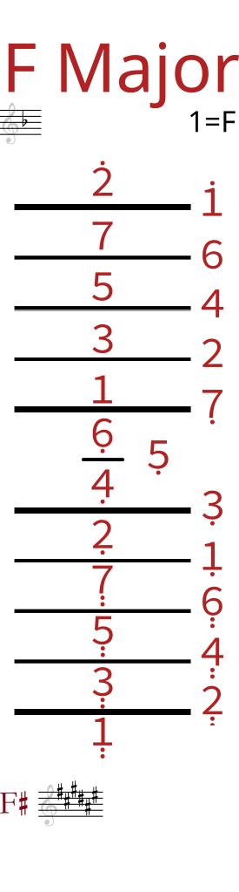

----

------

I made the above images in part using elements from [this Circle of Fifths graphic](https://commons.wikimedia.org/wiki/File:Circle_of_fifths_deluxe_4.svg),
by user Bill on Wikimedia. The original graphic was licensed [CC-BY-SA 3.0](https://creativecommons.org/licenses/by-sa/3.0/), and thus so too are the images on this page.
