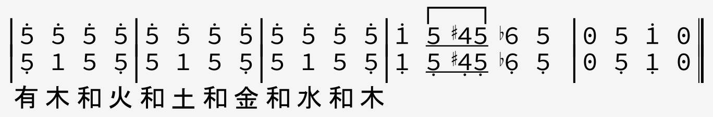

Tom Lehrer released his musical works into the public domain.
The lyrics, sheet music, and recordings can be found on [Tom Lehrer's website](https://tomlehrersongs.com/),
and are [mirrored on the internet archive](https://archive.org/details/tomlehrersongs).

## That's Mathematics

[See here for the original sheet music.](Lehrer/thats-mathematics-music.pdf)

`Key: 1=Bb`

<pre class="jianpu">
      3'-2'|1'----7-3|1'731'-7-3|7----6-3|7637-6-3|5----5-4|
</pre>
`| Counting | sheep When you're | trying to sleep, Being | fair When there's | something to share, Being | neat When you're |`

<pre class="jianpu">
|353'1'----|003'-2'-1'-|3'--2'-3'-2'|1'----7-3|1'731'-7-3|7----6-3|
</pre>
`| folding a sheet, | That's math - e - | mat - ics! When a | ball Bounces | off of a wall, When you | cook From a |`

<pre class="jianpu">
|7637-6-3|5----5-4|353'1'----|001'-6-7-|2'--1'-1'-^1'|2'-2'1'2'-2'1'|
</pre>
`| recipe book, When you | know How much | money you owe, | That's math - e -  | mat ics! How much | gold can you hold in an |`

<pre class="jianpu">
|2'1'_3'2'-1'-_6|5-535-53|53_76----|003-3-3-|3235--65|
</pre>
`| elephant's ear? When it's | noon on the moon Then what | time is it here? |     If  you could | count for a year Would you |`

<pre class="jianpu">
|3'-1'62'/2'/7-5|1'/1'1'/647/7/5--|
</pre>
`| get to infinity or | somewhere in that vicinity? |`

<pre class="jianpu">
|3''-1''6'2''7'-5'|1''-6'4'7'5'3'2'|        |        |        |        |
|1'-6475-3|6-425300|1'----7-3|1'731'-7-3|7----6-3|7637-6-3|
</pre>
`|    | When you | choose how much | postage to use, When you | know what's the | chance it will snow, When you |`

<pre class="jianpu">
|5----6-5|3'_3'2'^1'---5|^4-51'3'-1'6|4-61'3'2'1'2'|3'-------|1'-000000|
</pre>
`| bet and you | end up in debt, Oh, | try as you may, You just | can't get away From math - e - | mat -    | ics! |`

<pre class="jianpu">
|3''-1''6'2''7'-5'|1''-6'4'7'5'3'2'|        |        |        |        |
|1'-6475-3|6-425300|1'----7-3|1'731'-7-3|7----6-3|7637-6-3|
</pre>
`|    | Tap your | feet, keeping time | to the beat, Of a | song while you're | singing along, Harmo |`

<pre class="jianpu">
|5----6-5|3'^2'=2'^1'---5|^4-61'3'-1'6|4-61'3'2'1'2'|3'-------|1'----000||
</pre>
`| -nize with the | rest of the guys, Yes, | try as you may, You just | can't get away From math - e -  | mat -    | ics! |`

<!--TODO: Economics lyrics version-->

## The Elements (Aristotle's Version)

[See here for the original sheet music.](Lehrer/Elements-Aristotle.jpeg)

<pre class="jianpu">
|0 3 0 4|0 3 5 -|0 3 0 4|0 3 5   5|5 5 5 5|5 5 5/5. |1 5,/#/4,/5,/b6, 5, |0 5 1' 0||
|  1   2|0 1 5, -|  1   2|  1 5,  #2|3 3 3 3|3 3 3/3. |           |  4 5  ||
|  5,   7,|  5,    |  5,   7,|  5,     7,|       |        |           |  2 3  ||
|      5,|       |      5,|         |       |        |           |  7, 1  ||
|       |       |       |        4,|       |        |           |    1,  ||
|1,, 0 5,, 0|1,, 0 0 5,,|1,, 0 5,, 0|1,, 0 0   5,,|1, 5, 5,, 5,|1, 5, 5,, 5, |1,, 5,,/#/4,,/5,,/b6,, 5,, |0 5,, 1,, 0||
</pre>

Lyrics:

`There's earth and air and fire and wa-ter.`

### A similar adaption for the classical Chinese elements

<!--Need some way to notate the little gracenote flourishes-->

<!--ToDo: Chinese version with five elements
有 木 和 火 和 土 和 金 和 水 和 木

                          [--]
|5' - 5' 5'|5' 5' 5' 5'|5' 5' 5' 5'|1' 5/#/4/5/b6 5 |0 5 1' 0||
|5, - 5, 1|1 5 5, 5|1 5 5, 5|1, 5,/#/4,/5,/b6, 5, |0 5, 1, 0||

有 木 和 火 和 土 和 金 和 水 和 木

                           
|5' 5' 5' 5'|5' 5' 5' 5'|5' 5' 5' 5'|1' 5/#/4/5/b6 5 |0 5 1' 0||
|5, 1 5 5,|5 1 5 5,|5 1 5 5,|1, 5,/#/4,/5,/b6, 5, |0 5, 1, 0||

 

-->