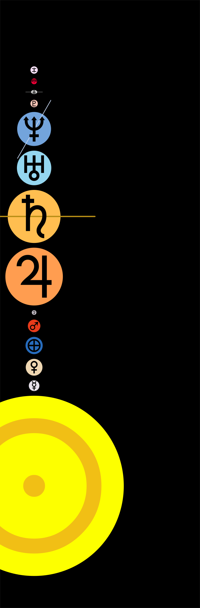
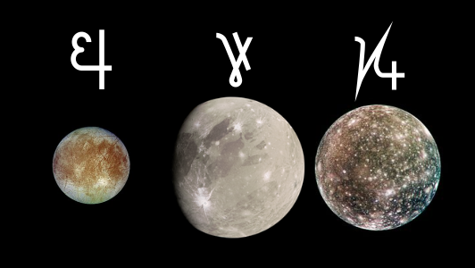
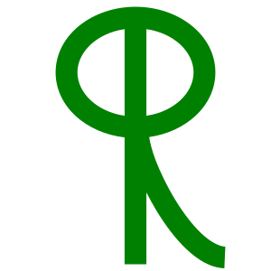
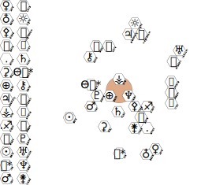
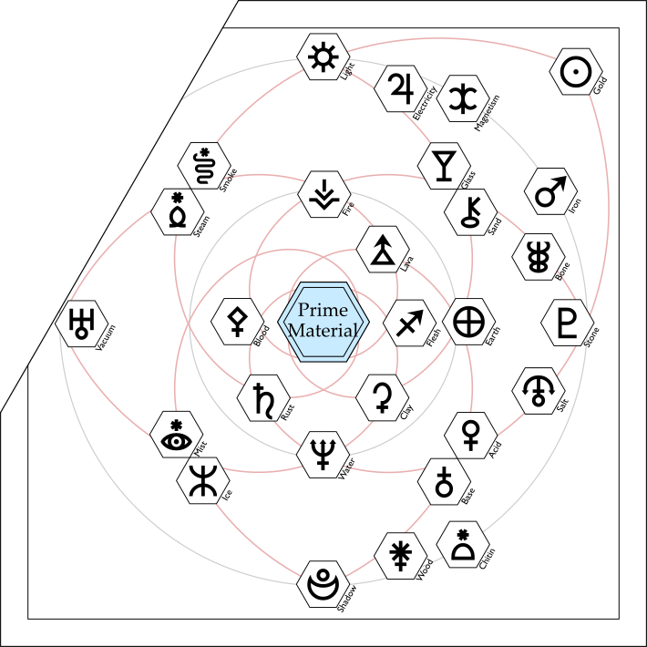
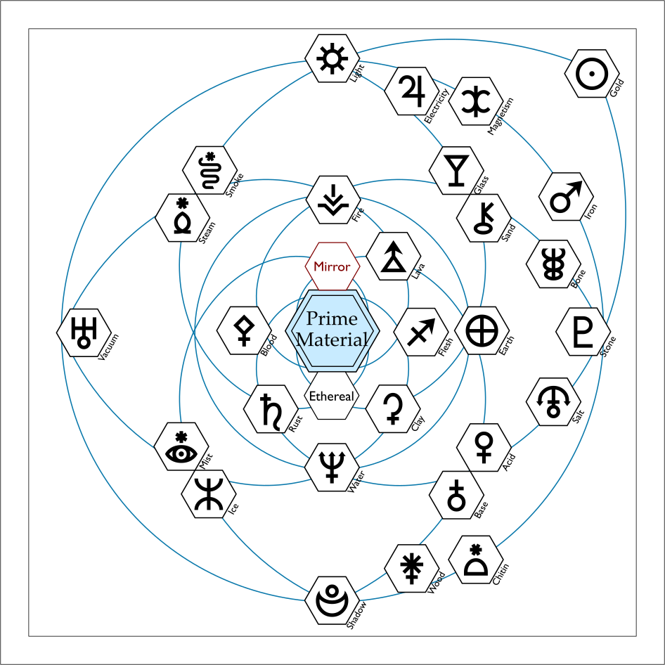
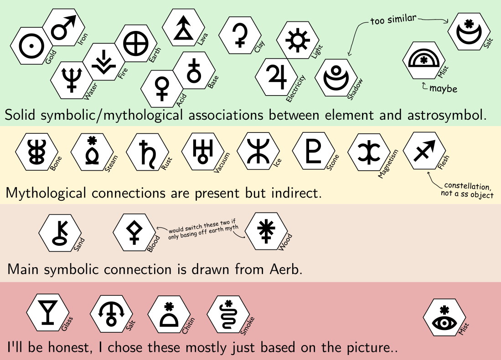
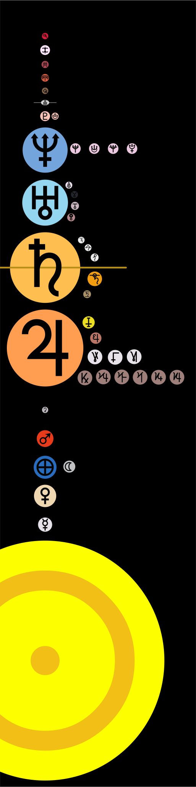
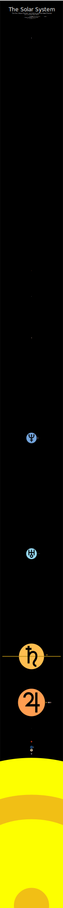

The following is an incomplete list of objects in the Solar System, along with their namesakes and symbols.

The symbols for the major planets, the Sun, Luna, Ceres, Pluto, and the early-discovered asteroids are all official and recognized by astronomers. (This is because all of these objects were at one point considered planets.)
The symbols for the other dwarf planets, the moons of other objects, etc. are unofficial. 
These mostly come from [public domain designs by Denis Moskowitz](https://suberic.net/~dmm/astro/index.html).
The designs for Europa, Ganymede, Callisto, and Orcus are my own designs (also public domain).

All of the astronomical symbols in the table below are copypasteable.
- If an astronomical symbol is in black, then it's an official part of the unicode standard.
- If a symbol is in blue, then it is implemented in the Private Use Area of the [Catrinity font](http://catrinity-font.de/). You'll need that specific font installed to use these characters.
- If a symbol is in red, then it's a symbol I've jankily implemented in webfont form.

Please don't treat this as an authoritative source on either Greco-roman mythology nor  astronomy. 
I have some links at the end. But the source for a lot of these snippets is "something I remember hearing from a Youtube video".

---

## The Eight Major Planets

<table>
<thead><tr>
<th>Planet</th>
<th>Features</th>
<th>Namesake</th>
</tr></thead>
<tr>
<td class="catsym">Mercury ☿</td>
<td>Tidally locked. Extreme temperatures. Very close to sun. Moves really fast around the sun. Closest planet to Earth (on average) yet also the most difficult to reach.</td>
<td>God of commerce and communication (and thieves and trickery). Guides souls to the underworld. Questionable fashion accessories. In Mandarin, called "water planet". Associated with the element mercury by alchemists.</td>
</tr>
<tr>
<td class="catsym">Venus ♀</td>
<td>Blisteringly hot, thick atmosphere. Clouds made of sulfuric acid.</td>
<td>God of love, prosperity, beauty, desire. Sometimes a god of war. Sometimes acts a bit bonkers. Started the Trojan war to win an apple. Symbol is just a modified ϕ (short for Phosphorus).  In Mandarin, called "metal planet". Associated with copper by alchemists.</td>
</tr>
<tr>
<td class="catsym">Terra ⊕ <small>alt: ♁</small></td>
<td>Liquid water surface oceans. Exotic slimes.</td>
<td>Earth. You know, dirt and stuff. </td>
</tr>
<tr>
<td class="catsym">Mars ♂</td>
<td>Inside the habitable zone. Covered in rust. Icy poles. Biggest mountain in the system. Inhabited by robots.</td>
<td>God of violent war and bloodshed! (Also, sometimes agriculture; he can be cool.) One time got stuck in a jar. Symbol is his shield and spear. In Mandarin, called "fire planet". Associated with iron by alchemists.</td>
</tr>
<tr>
<td class="catsym">Jupiter ♃ </td>
<td>Huge; like, really so big it's hard to believe. Bombarded by comets (might protect us from them). Has moons so big they're basically planets. Giant eternal storms. Band of intense radiation in a plasma torus around the equator.</td>
<td>King of the Gods. God of the sky and lightning. Adulterous creep.  In Mandarin, called "wood planet". Associated with tin by alchemists.</td>
</tr>
<tr>
<td class="catsym">Saturn ♄ </td>
<td>Another stormy giant. Weird polar hexagonal storm. Magnificent rings.</td>
<td>Titan of wealth, agriculture, cycles of renewal, and time. A horrible father, but a pretty good ruler of the world. Overthrown by his son Jupiter. Symbol is his scythe.  In Mandarin, called "earth planet". Associated with lead by alchemists.</td>
</tr>
<tr>
<td class="catsym">Uranus ♅ <small>alt: ⛢</small></td>
<td>Sideways ice giant. Made of eerily smooth gas. Mantle made of water and methane. Pressure near the core intense to cause diamond snow. Coldest planet?</td>
<td>Primordial sky god. Overthrown by his son Saturn.</td>
</tr>
<tr>
<td class="catsym">Neptune ♆ <small>alt: ⯉⯧</small></td>
<td>Another ice giant. Discovered with math. Tilted offset magnetic field.</td>
<td>God of the sea (and horses) (and in the greek equivalent, earthquakes).</td>
</tr>
</table>

---

## The Dwarf Planets

<i>(Personally, I liked Asimov's terminology suggestion of "Major Planet" for the big 8, "Minor Planet" for peedie things like comets and asteroids, and "Mesoplanet" for the Plutos and Cereses of the the system.)</i>

<table>
<thead><tr>
<th>Planet</th>
<th>Features</th>
<th>Namesake</th>
</tr></thead>
<tr>
<td class="catsym">Ceres ⚳</td>
<td>Largest asteroid. Made of clay and brine. Cryovolcanoes. Originally considered a planet. (Pluto is not unique in that regard.) There's a dead satellite orbitting around it. Has the water and organic compounds needed for life, but is far too cold and small for any chance of life occuring in Ceres' past.</td>
<td>God of the harvest, agriculture, and especially grain. Hates pigs. Winter happens when her daughter goes to the underworld. Guards the barrier between life and death? Ceres is also the namesake of Cerium, a soft rare-earth-element used in pigments and LEDs.</td>
</tr>
<tr>
<td class="catsym">Pluto ♇ <small>alt: ⯓⯔⯕⯖</small></td>
<td>Widest (but not most massive) object in the Kuiper belt. Weird tilted orbit.  Big heart-shaped plain of solid nitrogen the size of Texas. Equitorial dark spots made of tholins (space tar), the biggest of which is called "Cthulhu Macula". Mountains made of water ice. Thin hazy atmosphere. May have had liquid nitrogen lakes and subsurface water oceans in the past. (And yes, the unicode standard includes 5 variant symbols for Pluto.)</td>
<td>Ruler of the underworld. God of mineral wealth. Kidnapped Ceres' daughter, who must now stay in the underworld each winter because she ate an underworldly pomegranate.</td>
</tr>
<tr>
<td class="catsym">Haumea </td>
<td>Spins so fast it's egg-shaped. Tiny little rings. Both of these features are the result of the planet's history as the product of a violent collision between multiple objects.</td>
<td>Fertility god who gave humans the ability to give birth.</td>
</tr>
<tr>
<td class="catsym">Makemake </td>
<td>It's kinda red, but not, like, super red. Red-tinged and covered in pellets of solid methane. Not as much nitrogen as Pluto or Triton.</td>
<td>Lead god of the birdman cult. Associated with a proxy-war-like ritual involving a deadly race to collect the first tern egg of the season.</td>
</tr>
<tr>
<td class="catsym">Eris ⯰ <small>alt: ⯱</small></td>
<td>Incredibly distant from the Sun. Ever slightly more massive than Pluto, which led to the controversial decision to reclassify Pluto as Dwarf Planet. </td>
<td>God of strife and discord. Kickstarted the Trojan War with the apple incident. </td>
</tr>
</table>

And the following are a few of the objects most likely to be dwarf planets, which haven't been recognized by the IAU as such:

<table>
<thead><tr>
<th>Planet</th>
<th>Features</th>
<th>Namesake</th>
</tr></thead>
<tr>
<td class="catsym">Orcus 
O</td>
<td>Called the "anti-Pluto" because it's orbit is similar to Pluto's, yet opposite from it.   They are both resonant with neptune and have the same orbital period. Both of them cross over Neptune's orbit. But Pluto is close to the sun when Orcus is far away and vice versa. Also, both have a relatively large tidally locked moon, named after psychopomps. </td>
<td>Underworld god and punisher of broken oaths. Namesake of ogres, orcs, and orcas.It's moon, Vanth, is named after another psychopomp.</td>
</tr>
<tr>
<td class="catsym">Quaoar </td>
<td>Its icy shell was stripped away in a past collision.</td>
<td>Sang and danced the cosmos into being. Wild animals enforce his will.<!--https://www.sacred-texts.com/nam/ca/bosc/bosc04.htm--></td>
</tr>
<tr>
<td class="catsym">Gonggong 	共</td>
<td>Just barely big enough to hold onto volatile compounds..</td>
<td>Jerkwad serpent who knocked the earth off kilter. Also prone to causing floods, and his 9-headed sidekick had his teeth kicked in by Da Yu.</td>
</tr>
<tr>
<td class="catsym">Sedna ⯲</td>
<td>Almost as red as the planet Mars. Listen, they can't all be fascinating worlds with exciting geology and the potential for life. Sometimes it's a rock just really far away and all we know about it is a vague sense of its color.</td>
<td>God of the sea and sea creatures. Maybe she married a dog. Maybe she married a bird in disguise. Maybe she refused to marry anyone. The story varies. One way  or another, she lost her fingers, which turned into sea mammals.</td>
</tr>
</table>

---

## The Moons

Aka "satellite planets".
The word "moon" originally just referred to Luna, the moon of earth, and comes from a Proto-Indo-European word related to timekeeping and the month.

### Planetary Mass Moons

Here are the moons bigger than Pluto, and which would at the very least be classified as dwarf planets were they not orbiting around another body (in fact, Titan and Ganymede are even bigger than Mercury):

<table>
<thead><tr>
<th>Moon</th>
<th>Features</th>
<th>Namesake</th>
</tr></thead>
<tr>
<td class="catsym">Luna ☾</td>
<td>Tides and whatnot. It's *the* Moon. Likely the result of a massive collision between Earth and another planet, the same collision that gave earth its oceans.</td>
<td>God of the Moon. A bit redundant, I know. Often identified with Diana, god of the hunt, or Juno, god of marriage and childbirth. The Moon is mythologically associated with wolves, madness, womanhood, and shellfish. Or at least, it used to be. The shellfish association kinda disappeared from pop culture for some reason. Alchemists associated it with silver.</td>
</tr>
<tr>
<td class="catsym">Io 
I
 <small>(♃-I)</small></td>
<td>Least water of anywhere in the solar system. Sulfur atmosphere. Hundreds of volcanoes. Sulfur crust. Spews out plumes of sulfurous crud all the way into space. The crud is then accelerated by Jupiter's magnetic field to form the deadly radiation torus.</td>
<td>Lusted after by Jupiter, turned into a cow, tormented by a gadfly. Eventually got turned back to normal and married a king.</td>
</tr>
<tr>
<td class="catsym">Europa 
E
<small> (♃-II)</small></td>
<td>Smooth surface of cracked water ice, dotted with "chaos terrains". Bombarded by deadly radiation. Thin oxygen atmosphere (created by the radiation). Oceans under kilometers of ice. Promising spot for extraterrestial life.</td>
<td>This time, Jupiter turned his own dang self into a bovine, rode off with this lovely lady, and wooed her with the gifts of: a pet dog, a homing javelin, and a giant fighting robot.</td>
</tr>
<tr>
<td class="catsym"><small>Ganymede</small> 
G
<small> (♃-III)</small></td>
<td>Biggest moon. Has its own magnetic field. More water than earth, held in a subterranean ocean 100km deep (or maybe multiple layered oceans). *Very* thin oxygen atmosphere.</td>
<td>Really pretty guy. Abducted by Jupiter in bird form. Made immortal to serve as Juipter's personal cupbearer.</td>
</tr>
<tr>
<td class="catsym">Callisto 
K
<small> (♃-IV)</small></td>
<td>Lots of craters. Outside of the deadly radiation donut, so might be the best place near Jupiter to set up a human base. (Also, might have subterranean oceans. That's apparently pretty common in space.)</td>
<td>A nymph and follower of Diana. Jupiter raped her, then Artemis kicked her out because she wasn't a virgin anymore. A while later, Juno turned her into a bear, and then her own son hunted her down in bear form. Yeesh. </td>
</tr>
<tr>
<td class="catsym">Titan 
T
<small> (♄-VI)</small></td>
<td>2nd biggest moon. Thicker atmosphere than Earth's. Very hazy. Only place besides Earth with surface liquid (it's methane though), and thus the only place besides Earth to have whirlpools. Also might have an ammonia-water ocean underground, which erupts from cryovolcanoes. Soft crunchy surface. Permanent polar hurricances.<!--Victor of a clash between moons.--></td>
<td>Precursors to the Olympian gods. Not any specific titan, though. The other moons of Saturn are named after specific titans.</td>
</tr>
<tr>
<td class="catsym">Triton 
R
 <small>(♆-I)</small></td>
<td>Backwards, tilted orbit. Possibly a captured dwarf planet. Covered in nitrogen ice, similar composition to Pluto. Cryvolcanoes stain the surface with organic compounds. Thin nitrogen and methane atmosphere.</td>
<td>Son of Neptune. Merman with a magic conch.</td>
</tr>
</table>

<!--Callisto and its oceans of piss.-->

And here are a few more moons which are maybe big enough to probably count as dwarf planets, even if they aren't as dramatically large as the previous list.
Well, Enceladus is teeny tiny, but it's round and interesting enough that it seems to fit in with this list.

<table>
<thead><tr>
<th>Moon</th>
<th>Features</th>
<th>Namesake</th>
</tr></thead>
<tr>
<td class="catsym">Enceladus 
e
 <small>(♄-II)</small></td>
<td>Clean, reflective ball of ice.  Relatively hot tiger stripes detected under the south pole. The south pole shoots out water jets which turn into a blue icy ring around saturn.</td>
<td>Giant son of Gaia, and opponent of Athena.</td>
</tr>
<tr>
<td class="catsym">Tethys 
h
 <small>(♄-III)</small></td>
<td>Somewhat bigger and slightly less shiny than Enceladus. Almost entirely made of ice. Faintly bluish stripe.</td>
<td>Titan mother of thousands of minor ocean and river gods.</td>
</tr>
<tr>
<td class="catsym">Dione 
d
 <small>(♄-IV)</small></td>
<td>Networks of icy cliffs. <!--Possible subsurface liquid oceans? Hard to find mention of that outside wikipedia though?--> Resonant with Enceladus and its features might be more "mature" versions of that little moon's. Also, constantly bombarded with icey powder from Enceladus.</td>
<td>Titan. Mother of Aphrodite. (sometimes, when she isn't birthed from seafoam)</td>
</tr>
<tr>
<td class="catsym">Rhea 
r 
<small>(♄-V)</small></td>
<td>Described by NASA as a "dirty snowball". Has it's own tiny little rings. More cratered than the other ice moons of saturn.</td>
<td>Titan. Wife of Saturn who rescued baby Jupiter from being eaten.</td>
</tr>
<tr>
<td class="catsym">Iapetus 
i
 <small>(♄-VIII)</small></td>
<td>Tilted orbit around saturn. It's the only one of Saturn's moons with a good view of the rings. Walnut shape from huge equitorial ridge. One bright side and one dark side. </td>
<td>Titan, brother of Saturn. Father of Atlas and Prometheus. Sometimes later identified with one of Noah's sons?</td>
</tr>
<tr>
<td class="catsym">Ariel 
a
 <small>(♅-I)</small></td>
<td>Relatively bright and porous surface.</td>
<td>Slyph with power over the winds, bound to serve the magician Prospero.</td>
</tr>
<tr>
<td class="catsym">Umbriel 
u
 <small>(♅-II)</small></td>
<td>Darkest of the moons of Uranus</td>
<td>Dusky melancholy gnome.</td>
</tr>
<tr>
<td class="catsym">Titania 
t
 <small>(♅-III)</small></td>
<td>Enormous frost-lined canyons.</td>
<td>Queen of the Fey</td>
</tr>
<tr>
<td class="catsym">Oberon 
o
 <small>(♅-IV)</small></td>
<td>Scarred and cratered surface.</td>
<td>King of the Fey</td>
</tr>
<tr>
<td class="catsym">Charon ⯕ <small>(♇-I)</small></td>
<td>A moon big enough and close enough to Pluto make their center of gravity lie between the two.</td>
<td>Ferryman of the dead. Son of Nyx, god of night. Sibling to Thanatos and Hypnos, personifications of death and sleep. Kind of a gnarly old dude.</td>
</tr>
</table>

### Tiny Lumpy Moons

Here are a few more moons which aren't big enough to be properly rounded, but are 'famous' enough to mention. 

Mars' itty bitty teensy weeny moons, for example, are no more than a couple dozen km across, but they're notable for being so close to the surface of Mars that they appear large in the Martian sky.

<table>
<thead><tr>
<th>Moon</th>
<th>Features</th>
<th>Namesake</th>
</tr></thead>
<tr>
<td class="catsym">Phobos 
p
 <small>(♂-I)</small></td>
<td>Orbits close enough that it's being slowly pulled apart. Will likely crash into Mars or disintegrate into rings in about 40 millions years. One of the least reflective objects in the solar system.</td>
<td>Son of Mars and Venus. Personification of fear. Twin brother to Deimos.</td>
</tr>
<tr>
<td class="catsym">Deimos 
q
 <small>(♂-II)</small></td>
<td>Small enough that if you were standing on its surface, you could achieve escape velocity by jumping.</td>
<td>Son of Mars and Venus. Personification of the dread that drives men mad before a battle.</td>
</tr>
<tr>
<td class="catsym">Mimas 
m
 <small>(♄-I)</small></td>
<td>Looks like the Death Star from Star Wars. (Just a coincidence.) The temperature map supposedly looks like Pac-Man.</td>
<td>Giant son of Gaia. Divine punching bag.</td>
</tr>
<tr>
<td class="catsym">Miranda 
n
 <small>(♅-I)</small></td>
<td>Lumpy. Orbits weirdly close to Uranus.</td>
<td>The daughter of the magician Prospero.</td>
</tr>
<!--<tr>
<td class="catsym">Vanth 
v
 <small>(O-I)</small></td>
<td>Tidally locked, relatively big compared to its planet, similar to the Pluto+Charon system.</td>
<td>A winged psychopomp associated often accompanied by Charun, the Estruscan version of Charon. The name was suggested by an internet commenter to further the parallels between Pluto and Orcus</td>
</tr>-->
</table>

---

## Theorized Planets

<table>
<thead><tr>
<th>Name</th>
<th>Features</th>
<th>Namesake</th>
</tr></thead>
<tr>
<td class="catsym">Theia</td>
<td>The hypothetical water-rich ancient planet which collided with the young Earth. After the debris settled, the solar system was left with the Terra and Luna we all know and love.</td>
<td>Titan. Mother of the sun, the moon, and the dawn. Endowed precious metal and gems with their beauty.</td>
</tr>
<tr>
<td class="catsym">Vulcan ⯦</td>
<td>Urbain Le Verrier famously predicted the existence of Neptune through irregularities in the orbit of Uranus. He also predicted the existence of Vulcan through the irregularities in the orbit of Mercury. Alas, Vulcan doesn't exist. Rather, the irregularities are explained by general relativity. However, the space between the sun and Mercury is surprisingly empty compared to what we see in other systems. So maybe such a planet did exist long ago before spiraling into the sun.</td>
<td>God of fire, the forge, volcanoes, and deserts. Frought marriage with Venus.</td>
</tr>
<tr>
<td class="catsym">The Fifth Giant</td>
<td>Computer simulations of the early somewhat suggest that the shape of the solar system is more easily explained if there used to be a third ice giant which has since been ejected from the system.</td>
<td>This hypothetical fifth giant is sometimes informally referred to as Hades, Liber (party wine god), or Mephitis (god of the noxious gasses that seap from the ground).</td>
</tr>
</table>

---

## The Sun

<table>
<tr>
<td class="catsym">Sol ☉ <small>alt: ☀☼</small></td>
<td>1. <a href="https://www.youtube.com/watch?v=3JdWlSF195Y">An explanation of the sun</a>. 2. <a href="https://www.youtube.com/watch?v=sLkGSV9WDMA">A correction to this explanation</a>.</td>
<td>The word sol means "the sun". Speaking of grecoroman myth, it's often associated with Apollo (who does some future sight business), and Helios (who rides around with his sky horses.). The sun is classically associated with gold, and Helium is named after Helios because of Helium's role in nuclear fusion.</td>
</tr>
</table>

---

## The Minor Planets

These are now properly called "small solar system bodies".

People initially considered these planets and gave them symbols. Around the discovery of 16 Psyche is when astronomers realized there are too many of the dang things to dote on each one individually, and just started giving them numbers.

<!--2005 VX3: Highly eccentric. Possibly a dormant comet.
https://en.wikipedia.org/wiki/514107_Ka%CA%BBepaoka%CA%BBawela-->

Below, I've listed the first batch discovered, as well as some notable objects discovered later on. [A much much more comprehensive list can be found here.](https://en.wikipedia.org/wiki/Meanings_of_minor_planet_names#Index)

<table>
<thead><tr>
<th>Rock</th>
<th>Namesake+Notes</th>
</tr></thead>
<tr><td class="catsym">1 Ceres ⚳</td><td> God of grain, harvest, motherhood. Biggest Asteroid. First discovered. Now considered a dwarf Planet, listed above.</td></tr>
<tr><td class="catsym">2 Pallas ⚴</td><td> Athena and her spear. A lot of other mythological characters are named Pallas as well.   The asteroid is is the third most massive, as dark as asphalt, and on a highly tilted orbit.</td></tr>
<tr><td class="catsym">3 Juno ⚵</td><td> God of marriage and childbirth. Sometimes associated with the moon.</td></tr>
<tr><td class="catsym">4 Vesta ⚶</td><td> God of hearth and home.   This asteroid is the second most massive, and is a surviving rocky protoplanet, like the frozen embryo of a terrestrial world. About a billion years ago, it suffered from two giant impacts. The splash from one of these impacts gave Vesta a mountain to rival Olympus Mons. And the debris from the impact was scattered throughout the solar system (5% of meteorites that hit Earth are chunks of Vesta).</td></tr>
<tr><td class="catsym">5 Astraea  ⯙⚖</td><td> God of justice, innocence, purity, and precision.</td></tr>
<tr><td class="catsym">6 Hebe  <small>🍷︎</small></td><td> God of youth and forgiveness, Cupbearer to the gods. Married Heracles and retired after Ganymede was brought into the operation.</td></tr>
<tr><td class="catsym">7 Iris  </td><td> God of rainbows. Messenger of the gods.</td></tr>
<tr><td class="catsym">8 Flora  ⚘</td><td> God of flowers and springtime.</td></tr>
<tr><td class="catsym">9 Metis  </td><td> Titan of wisdom and skilled council. Mother of Athena.</td></tr>
<tr><td class="catsym">10 Hygiea  ⯚<!--⚕--></td><td> God of cleanliness, sanitation, and preventative medicine. Daughter of Asclepius, god of medicine. I think the official unicode glyph is supposed to be a rod of Asclepius (one snake), but looks more like a caduceus (two snakes, Hermes) to me.   4th largest asteroid.</td></tr>
<tr><td class="catsym">11 Parthenope  </td><td> Siren Either failed to lure Odysseus or was turned into a city by Jupiter.</td></tr>
<tr><td class="catsym">12 Victoria  </td><td> God of victory.</td></tr>
<tr><td class="catsym">13 Egeria  </td><td> Nymph who gave laws and to early Rome. </td></tr>
<tr><td class="catsym">14 Irene  </td><td> Personification of peace. Sister to Dike (Justice) and Eunomia (Order). Daughter of Themis</td></tr>
<tr><td class="catsym">15 Eunomia  </td><td> Personification of Order. God of law, legistlation, and pastures.</td></tr>
<tr><td class="catsym">16 Psyche  </td><td> God of the soul. A beautiful mortal who married Cupid and was tormented by his mother Venus. The symbol is supposed to be a butterfly's wing.   The asteroid is thought to be the exposed core of a shattered protoplanet, and there's a plan to visit it in 2026. (Mission tagline: "Journey to a Metal World")</td></tr>
<tr><td class="catsym">17 Thetis  </td><td> Sea nymph, mother of Achilles</td></tr>
<tr><td class="catsym">18 Melpomene  </td><td> Muse of the Chorus and Tregedy.</td></tr>
<tr><td class="catsym">19 Fortuna  </td><td> God of fate and fortune. She is commonly said to be blind. Had a fancy wheel which was later adapted into a popular game show.</td></tr>
<tr><td class="catsym">20 Massalia</td><td> Named after a city.</td></tr>
<tr><td class="catsym">21 Lutetia</td><td> Named after a city. One of the densest asteroids.</td></tr>
<tr><td class="catsym">22 Kalliope</td><td> Muse of epic poetry. Chief of the Muses. Turned some uppity mortals into songbirds.</td></tr>
<tr><td class="catsym">23 Thalia</td><td> Muse of comedy.</td></tr>
<tr><td class="catsym">24 Themis</td><td> Titan of divine law. Second wife of Jupiter.</td></tr>
<tr><td class="catsym">25 Phocaea</td><td> Named after a city.</td></tr>
<tr><td class="catsym">26 Proserpina  </td><td> Daughter of Ceres. Stuck in the underworld each winter because Pluto kidnapped her and fed her those underworldly pomegranite seeds. Also a god of springtime, wine, and a terrifying Queen of the underworld.</td></tr>
<tr><td class="catsym">28 Bellona  </td><td> Wife of Mars. Also a god of a crazed bloodthirsty war. Likes to ride into battle with her hubby and has a special talent when it comes to destroying entire cities.</td></tr>
<tr><td class="catsym">29 Amphitrite  </td><td> Neptune's wife. God of the sea and salt water.</td></tr>
<tr><td class="catsym">30 Urania</td><td> Muse of astronomy.</td></tr>
<tr><td class="catsym">31 Euphrosyne</td><td> God of good cheer. </td></tr>
<tr><td class="catsym">32 Pomona</td><td> Wood nymph. God of orchards.</td></tr>
<tr><td class="catsym">33 Polyhymnia</td><td> Muse of sacred poetry and pantomime.</td></tr>
<tr><td class="catsym">34 Circe</td><td> Wizard Queen. Transmogrified people into animals. Daughter of the Sun.</td></tr>
<tr><td class="catsym">35 Leukothea  </td><td> A nymph or queen who leapt into the sea. The symbol is an old-timey lighthouse.</td></tr>
<tr><td class="catsym">37 Fides  </td><td> God of trust and reliability. Astronomers pretty much completely gave up on the asteroid symbols past this point.</td></tr>
<tr><td class="catsym">38 Leda</td><td> Spartan queen. Made love to swan-Jupiter, and gave birth two eggs from which hatched Helen of Troy, and the twins Castor and Pollux.</td></tr>
<tr><td></td><td></td></tr>
<tr><td class="catsym">243 Ida</td><td> A nymph who nursed Jupiter. Also the name of the mountain where baby Jupiter was hidden away.   The asteroid was the first discovered to have its own tiny asteroid moon.   The moon is named "Dactyl", after a group of weird little forge fellas that lived on Mount Ida and protected Jupiter. </td></tr>
<tr><td class="catsym">253 Mathilde</td><td> Named after an Astronomer's wife.   The asteroid was visited by a probe on its way to 433 Eros, and scientists were surprised to see that 253 Mathilde is a loosely packed pile of rubble, more crater than stone.</td></tr>
<tr><td class="catsym">433 Eros</td><td> Aka Cupid. God of erotic desire. Had a romance with Psyche.   This asteroid was the first near-earth asteroid to be discovered. It was also the first asteroid people put an orbiter around, and the first asteroid to be landed on. Rich in precious metals. About as big as the asteroid that wiped out the dinos, and has high odds of slamming into the earth in the very distant future.</td></tr>
<tr><td class="catsym">624 Hektor</td><td> A mythological Trojan Prince.   The largest of the Jupiter Trojans, which are similar to asteroids, but orbiting in Jupiter's Lagrange points. It's extremely elongated, and has a little moon named Skamandrios, after the mythological Hektor's son.</td></tr>
<tr><td class="catsym">704 Interamnia</td><td> Named after a city.   5th largest asteroid but poorly studied.</td></tr>
<tr><td class="catsym">1862 Apollo</td><td> God of the sun, fortune telling, and all sorts of stuff.   This asteroid was the first discovered example and namesake of the Apollo-class asteroids, asteroids whose orbits cross Earth's. (If you remember the meteor that hit Russia back in 2013, that came from an Apollo-class object.)</td></tr>
<tr><td class="catsym">2060 Chiron ⚷</td><td> The wisest of the centaurs. Trainer of heroes. Inventor of botany.   The object Chiron was the first recognized example of the astronomical centaurs, a group of objects like asteroids but which orbit further out between the gas giants. They're so named because they seem to resemble a combination of asteroid and comet.</td></tr>
<tr><td class="catsym">3200 Phaethon</td><td> Son of Helios, the sun god. Took his dad's sun chariot for a joy ride, almost destroyed the world, and had to be struck down with a lightning bolt by Jupiter.   This Apollo-class asteroid is so named because it flies closer to the sun than any other asteroid.</td></tr>
<tr><td class="catsym">5145 Pholus ⯛</td><td>Another very smart centaur. Friend of Heracles. The object was the second astronomical centaur to be discovered.</td></tr>
<tr><td class="catsym">7066 Nessus ⯜</td><td>A centaur. Unlike the previous two, this centaur was a total creep. He tried to rape Heracles' wife, so Heracles killed him with some turbo poison. Years later, Heracles put on a shirt that was stained with the turbo-poisoned centaur blood, and Heracles himself was killed. The object was the third astronomical centaur to be discovered.</td></tr>
<tr><td class="catsym">10199 Chariklo</td><td> A nymph, wife to the centaur Chiron.   This object is the largest (yet found as of 2019) of the astronomical centaurs, and the smallest object known to have rings.</td></tr>
<tr><td class="catsym">25143 Itokawa</td><td> Named for the father of Japanese rocketry.   Rubble pile shaped like a lumpy sea otter. This was the first asteroid from which a sample was collected and brought back to Earth. It's  also the smallest asteroid ever visited.</td></tr>
<tr><td class="catsym">28978 Ixion </td><td>The first man to kill his kin. Jupiter showed him mercy, but then he violated hospitality by making love to a cloud shaped like Juno. (The cloud got pregnant. This is where centaurs come from.) As punishment for his crimes, the gods chained him to a wheel, lit him on fire and hucked him like a frisbee across the sky. The object Ixion is a plutino and maaaaaybe a dwarf planet.</td></tr>
<tr><td class="catsym">42355 Typhon </td><td>The object is the first binary centaur to be discovered, together with its moon Echidna. In myth, Typhon was a giant snakeman monster who tried to overthrow Jupiter as king of the world. Echidna was his giant monster lover who gave birth to loads of famous monsters. </td></tr>
<tr><td class="catsym">65803 Didymos</td><td> The name is Greek for "twin".   It has a moonlet called "Dimorphos", meaning "Two forms."   NASA's DART mission is planning to test our planetary defense capabilities by ramming into Dimorphos as high speed in 2022. </td></tr>
<tr><td class="catsym">99942 Apophis</td><td> A primordial serpent who sought to devour the sun.   When this asteroid was first discovered, measurements suggested there was a small chance it would impact the Earth. That's since been ruled out, but it will pass by incredibly close in 2029.</td></tr>
<tr><td class="catsym">101955 Bennu</td><td> Named for a mythological bird associated with the creation of the world.   An Apollo-class object with an unstable orbit. It has a low chance of crashing into the Earth next century, but is more likely to spiral into the sun or crash into Venus. As of May 2021, a spacecraft has collected a sample and is bringing it back to Earth.</td></tr>
</table>

<!--
1 Ceres ⚳
: God of grain, harvest, motherhood. Biggest Asteroid. First discovered. Now considered a dwarf Planet, listed above.

2 Pallas ⚴
: Athena and her spear. A lot of other mythological characters are named Pallas as well. 
: The asteroid is is the third most massive, as dark as asphalt, and on a highly tilted orbit.

3 Juno ⚵
: God of marriage and childbirth. Sometimes associated with the moon.

4 Vesta ⚶
: God of hearth and home. 
: This asteroid is the second most massive, and is a surviving rocky protoplanet, like the frozen embryo of a terrestrial world. About a billion years ago, it suffered from two giant impacts. The splash from one of these impacts gave Vesta a mountain to rival Olympus Mons. And the debris from the impact was scattered throughout the solar system (5% of meteorites that hit Earth are chunks of Vesta).

5 Astraea ⯙
: God of justice, innocence, purity, and precision.

6 Hebe 
: God of youth and forgiveness, Cupbearer to the gods.

7 Iris 
: God of rainbows. Messenger of the gods.

8 Flora 
: God of flowers and springtime.

9 Metis 
: Titan of wisdom and skilled council. Mother of Athena.

10 Hygiea ⯚
: God of cleanliness, sanitation, and preventative medicine. Daughter of Asclepius, god of medicine. I think the official unicode glyph is supposed to be a rod of Asclepius (one snake), but looks more like a caduceus (two snakes, Hermes) to me. 
: 4th largest asteroid.

11 Parthenope 
: Siren Either failed to lure Odysseus or was turned into a city by Jupiter.

12 Victoria 
: God of victory.

13 Egeria 
: Nymph who gave laws and to early Rome. 

14 Irene 
: Personification of peace. Sister to Dike (Justice) and Eunomia (Order). Daughter of Themis

15 Eunomia 
: Personification of Order. God of law, legistlation, and pastures.

16 Psyche 
: God of the soul. A beautiful mortal who married Cupid and was tormented by his mother Venus. The symbol is supposed to be a butterfly's wing. 
: The asteroid is thought to be the exposed core of a shattered protoplanet, and there's a plan to visit it in 2026. (Mission tagline: "Journey to a Metal World")

17 Thetis 
: Sea nymph, mother of Achilles

18 Melpomene 
: Muse of the Chorus and Tregedy.

19 Fortuna 
: God of fate and fortune. She is commonly said to be blind. Had a fancy wheel which was later adapted into a popular game show.

20 Massalia
: Named after a city.

21 Lutetia
: Named after a city. One of the densest asteroids.

22 Kalliope
: Muse of epic poetry. Chief of the Muses. Turned some uppity mortals into songbirds.

23 Thalia
: Muse of comedy.

24 Themis
: Titan of divine law. Second wife of Jupiter.

25 Phocaea
: Named after a city.

26 Proserpina ⯘
: Daughter of Ceres. Stuck in the underworld each winter because Pluto kidnapped her and fed her those underworldly pomegranite seeds. Also a god of springtime, wine, and a terrifying Queen of the underworld.

28 Bellona 
: Wife of Mars. Also a god of a crazed bloodthirsty war. Likes to ride into battle with her hubby and has a special talent when it comes to destroying entire cities.

29 Amphitrite 
: Neptune's wife. God of the sea and salt water.

30 Urania
: Muse of astronomy.

31 Euphrosyne
: God of good cheer. 

32 Pomona
: Wood nymph. God of orchards.

33 Polyhymnia
: Muse of sacred poetry and pantomime.

34 Circe
: Wizard Queen. Transmogrified people into animals. Daughter of the Sun.

35 Leukothea 
: A nymph or queen who leapt into the sea. The symbol is an old-timey lighthouse.

37 Fides 
: God of trust and reliability. Astronomers pretty much completely gave up on the asteroid symbols past this point.

38 Leda
: Spartan queen. Made love to swan-Jupiter, and gave birth two eggs from which hatched Helen of Troy, and the twins Castor and Pollux.

...

243 Ida
: A nymph who nursed Jupiter. Also the name of the mountain where baby Jupiter was hidden away. 
: The asteroid was the first discovered to have its own tiny asteroid moon. 
: The moon is named "Dactyl", after a group of weird little forge fellas that lived on Mount Ida and protected Jupiter. 

253 Mathilde
: Named after an Astronomer's wife. 
: The asteroid was visited by a probe on its way to 433 Eros, and scientists were surprised to see that 253 Mathilde is a loosely packed pile of rubble, more crater than stone.

433 Eros
: Aka Cupid. God of erotic desire. Had a romance with Psyche. 
: This asteroid was the first near-earth asteroid to be discovered. It was also the first asteroid people put an orbiter around, and the first asteroid to be landed on. Rich in precious metals. About as big as the asteroid that wiped out the dinos, and has high odds of slamming into the earth in the very distant future.

624 Hektor
: A mythological Trojan Prince. 
: The largest of the Jupiter Trojans, which are similar to asteroids, but orbiting in Jupiter's Lagrange points. It's extremely elongated, and has a little moon named Skamandrios, after the mythological Hektor's son.

704 Interamnia
: Named after a city. 
: 5th largest asteroid but poorly studied.

1862 Apollo
: God of the sun, fortune telling, and all sorts of stuff. 
: This asteroid was the first discovered example and namesake of the Apollo-class asteroids, asteroids whose orbits cross Earth's. (If you remember the meteor that hit Russia back in 2013, that came from an Apollo-class object.)

2060 Chiron ⚷
: The wisest of the centaurs. Trainer of heroes. Inventor of botany. 
: The object Chiron was the first recognized example of the astronomical centaurs, a group of objects like asteroids but which orbit further out between the gas giants. They're so named because they seem to resemble a combination of asteroid and comet.

3200 Phaethon
: Son of Helios, the sun god. Took his dad's sun chariot for a joy ride, almost destroyed the world, and had to be struck down with a lightning bolt by Jupiter. 
: This Apollo-class asteroid is so named because it flies closer to the sun than any other asteroid.

10199 Chariklo
: A nymph, wife to the centaur Chiron. 
: This object is the largest (yet found as of 2019) of the astronomical centaurs, and the smallest object known to have rings.

25143 Itokawa
: Named for the father of Japanese rocketry. 
: Rubble pile shaped like a lumpy sea otter. This was the first asteroid from which a sample was collected and brought back to Earth. It's  also the smallest asteroid ever visited.

65803 Didymos
: The name is Greek for "twin". 
: It has a moonlet called "Dimorphos", meaning "Two forms." 
: NASA's DART mission is planning to test our planetary defense capabilities by ramming into Dimorphos as high speed in 2022. 

99942 Apophis
: A primordial serpent who sought to devour the sun. 
: When this asteroid was first discovered, measurements suggested there was a small chance it would impact the Earth. That's since been ruled out, but it will pass by incredibly close in 2029.

101955 Bennu
: Named for a mythological bird associated with the creation of the world. 
: An Apollo-class object with an unstable orbit. It has a low chance of crashing into the Earth next century, but is more likely to spiral into the sun or crash into Venus. As of May 2021, a spacecraft has collected a sample and is bringing it back to Earth.
-->

### Other Space Whatsits

ʻOumuamua
: The first known instellar object to visit the Solar System. 
: Its name means something like "scout". Probably not aliens, but for a while there, that wasn't a completely ludicrous hypothesis.

2019 OK
: An Apollo-class object that passed close to the Earth in 2019. Because of the angle of its orbit, we had very little warning about its approach. 
: The name is just based on the date of its discovery, and doesn't follow the normal asteroid number naming pattern.

## Constellations

These aren't actually objects so much as they're regions of the sky.

|Symbol|Name|Depicts|
|:-:|:--|:--|
| ♈︎ | aries | shep |
| ♉︎ | taurus | coo |
| ♊︎ | gemini | Castor and Pollux, sons of Leda, from the swan thing |
| ♋︎ | cancer | crab |
| ♌︎ | leo | big cat |
| ♍︎ | virgo | A gal. Sometimes specifically Astraea, the namesake of asteroid 5. |
| ♎︎ | libra | claws |
| ♏︎ | scorpius | scary bug. Even Orion is scare |
| ♐︎ | sagittarius | a centaur maybe? |
| ♑︎ | capricorn | goatfish (it was a thing in Babylon don't worry about it) |
| ♒︎ | aquarius | waterbottle |
| ♓︎ | pisces | two fish... tied together with a rope |
| ⛎︎ | Ophiuchus | wrasslin snek |

## Various Other Astro Symbols

- Symbols for the relative posititions of objects: ☊☋☌☍⚹⚺⚻⚼⯳⯴⯵⯶⯷⯸
- Some fortune-teller-types use "Lilith" and "Priapus" to refer to the Moon's perigee and apogee. (Nearest and farthest orbital points from the Earth.) ⚸⯞ Lilith is either a primordial demon or the first woman, sculpted from the same clay as Adam. Priapus is the god of beekeeping and jumbo schlongers. 
- Then there's also "White Moon Selena" and "True Light Moon Arta" ⯝⯟, astrological points which have *some* sort of connection to the moon's orbit. I tried following the citations from the unicode documents, but [the page I ended up at](https://astrologer.ru/book/light_moon/index.html.en) gave off powerful Time Cube energy.
- Speculating about a major planet out past Pluto is a popular hobby, and astrologers haven't skipped out on the fun. 
    - ⯗ Generic Transpluto Planet: This character is listed in the unicode standard simply as "Transpluto". <!--Sometimes called Isis(TODO) or Bacchus (god of inebriation and madness).-->
    - ⯘ Proserpina: Same namesake as asteroid 26, but otherwise no connection. (But yeah, dang. Given the myth, maybe that name should have been saved for an eccentric Kuiper belt object, like a comet or something.)
    - There's also  ⯠ Cupido, ⯡ Hades, ⯢ Zeus, ⯣ Kronos, ⯤ Apollon, ⯥ Admetos, ⯦ Vulcanus, and ⯧ Poseidon . 
        - Most of those are just alternate names for gods that already had a planet or asteroid named after them. I do have to admit, however, that the symbol for Vulcanus is super snazzy.
        - The odd one out here is Admetos. His story is that Apollo loved this guy a lot, and so when he learned that Admetus was soon fated to die, Apollo convinced the fates to let someone else die in his place. But oh no, his wife Alcestis is the one who volunteers to die! Ironic tragedy! It all works out in the end because Heracles stops by, wrassles Thanatos into submission, and brings Alcestis back to the world of the living.
- Star and comet ★☆☄. Eclipse and crescent thing 

&#xF5B6;
&#xF5B7;
&#xF5B8;
&#xF5B9;
&#xF5BA;
&#xF5BB;

---

## My designs:

Jupiter's Symbol is the letter zeta crossed with Jupiter's staff. 
These symbols for E Europa, G  Ganymede and C  Callisto - all watery moons of Jupiter - take the first greek letter of the moon's name (γ,ε,ϰ), and cross it with with a line. [Moskowitz' symbols for these moons](https://suberic.net/~dmm/astro/moons.html) are similar, but with capital letters. 
The miniscule versions of the letters just felt more *spacey* to me.

Plus, as a bonus, this version of the Europa symbol looks vaguely like a bull's horns, and a lowercase gamma looks a bit like a bird.

Then just as PLuto's symbol is a combination of P and L, this symbol for 
O Orcus is a combination of O and R, (arranged to look like a scary monster eyeball.)

---

<!--

-->

<!--

Here is a quadratically scaled solar system.
I'm playing around with the symbols for some of the moons.

And here is one to scale:

https://www.heritagetype.com/pages/free-vintage-illustrations
-->

## Relevant Links:
- Object Info:
    - [List of names of astrobodies, and their associations from the USGS.](https://planetarynames.wr.usgs.gov/Page/Planets)
    - [NASA Planetary Fact Sheet](https://nssdc.gsfc.nasa.gov/planetary/factsheet/)
    - [Physical data for Moons](https://ssd.jpl.nasa.gov/?sat_phys_par)
    - [Wikipedia - List of gravitationally rounded objects of the Solar System](https://en.wikipedia.org/wiki/List_of_gravitationally_rounded_objects_of_the_Solar_System)
    - [JPL Small-Body Database Browser](https://ssd.jpl.nasa.gov/sbdb.cgi?sstr=24)
    - [IAU Minor PLanet Center](https://minorplanetcenter.net//iau/lists/MPNames.html)
    - [Astrum youtube channel](https://www.youtube.com/c/astrumspace/videos)
    - [Anton Petrov youtube channel](https://www.youtube.com/c/whatdamath/videos)
- Symbols:
    - [Wikipedia - Astronomical Symbols](https://en.wikipedia.org/wiki/Astronomical_symbols) has all of the official ones.
    - [Wikimedia - Asteroid Symbols](https://commons.wikimedia.org/wiki/Asteroid_symbols)
    - [New astro symbols, by Denis Moskowitz.](https://suberic.net/~dmm/astro/index.html) (A couple have actually made it into the unicode standard.)
    - [Catrinity font](http://catrinity-font.de/)
    - The charts with the codepoints of the astro symbols: [Unicode1](
https://www.unicode.org/charts/nameslist/n_2600.html), [Unicode2](
https://www.unicode.org/charts/nameslist/n_2B00.html), [Catrinity](http://catrinity-font.de/downloads/CatrinityPrivateUseArea.pdf). (ctrl+f "astro")
    - [The janky font I made for moon symbols.](https://bacontime.github.io/moonsymbols.ttf)
- Namesakes:
    - [Overly Sarcastic - Miscellaneous Myths](https://www.youtube.com/playlist?list=PLDb22nlVXGgeoPb-HBWwzEeoAwDvckSrC)
    - [Quaoar faq](http://www.chadtrujillo.com/quaoar/)
    - [Gazetteer of Planetary Nomenclature](https://planetarynames.wr.usgs.gov/)
- Other:
    - [Space tourism posters](https://solarsystem.nasa.gov/resources/682/space-tourism-posters/)
    - [This old janky nasa.gov subsite for kids.](https://starchild.gsfc.nasa.gov/docs/StarChild/solar_system_level2/solar_system.html)
    - [XKCD planet surface area comparison](https://xkcd.com/1389/)

<!--
https://nineplanets.org/hypothetical-planets/#vulcan

https://web.archive.org/web/20110429095406/http://www.tongva.com/-->

<!--
Some public domain image sources:

- https://commons.wikimedia.org/wiki/Category:Pearson_Scott_Foresman_publisher
- https://commons.wikimedia.org/wiki/User:LadyofHats
- https://commons.wikimedia.org/wiki/Category:Health_Physics_Posters
- https://commons.wikimedia.org/wiki/Category:PD_US_Government
- https://docs.google.com/document/d/1JwR9ngrwxi8LgrHMAyQEmd_ZY9MDRUGKZLTq-WBvKsw/edit
- https://docs.google.com/document/d/1tv8s70yrZMJPsZmn77jlKd3BrJjIKnT2UIk1LxGOTms/edit#heading=h.jcvaf0ril1oe
- https://recedingrules.blogspot.com/p/public-domain-images.html
- https://commons.wikimedia.org/wiki/Commons:Bible_Illustrations
- https://www.rawpixel.com/libraryofcongress/showcase?sort=curated&mode=shop&page=1
826400
-->

