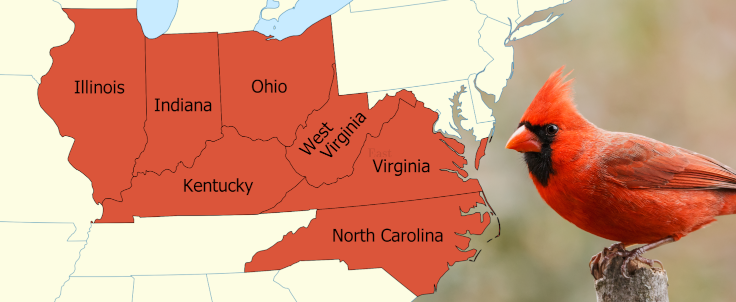
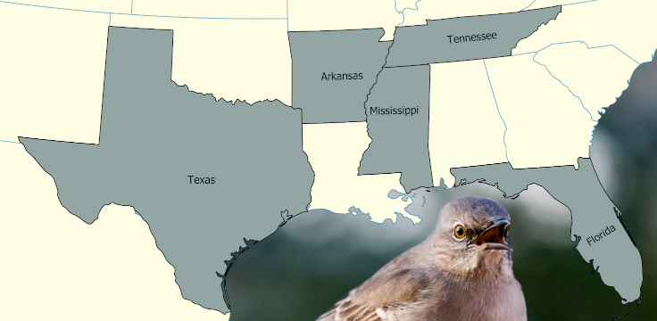
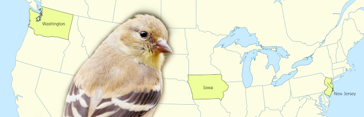
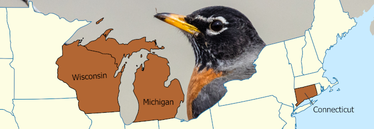
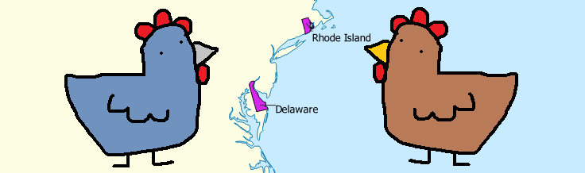

<!--Reminder: This page from sklearn has a list of classifiers to look at.
https://scikit-learn.org/stable/modules/model_evaluation.html#balanced-accuracy-score
-->

In [*The State Birds are Garbage*](https://www.youtube.com/watch?v=JAZI5GcPm8c),
Jam2go calculates "BIRD Uniqueness Points" for each (bird,state) pair, 
and uses this to assign new state birds.

<!--<iframe width="560" height="315" maxwidth="100%" src="https://www.youtube-nocookie.com/embed/JAZI5GcPm8c" title="YouTube video player" frameborder="0" allow="accelerometer; autoplay; clipboard-write; encrypted-media; gyroscope; picture-in-picture" allowfullscreen></iframe>

  

    Table of contents
  

- TOC
{:toc}

-->

The video is about much more than that, and is definitely worth a watch,
but I found the results of his exercise disappointing. 
As such, I downloaded 200 gigs of bird data and reran the numbers myself.

## Deviations From Jam2go's BIRDUP

### Solving the Warbler Problem

We want our new set of state birds to be full of variety.
But Jam2go's metric gives us a bunch of warblers.

Even after explicitly excluding warblers, 
their metric gives both the Lesser Prairie Chicken and Greater Prairie Chicken as state birds.
I know one is two inches longer, but that's still too samey for my taste.

To promote taxonomic variety, 
I rank the birds by Genus, and then pick an example species,
instead of computing scores for individual species.

<!--Species devisions are somewhat fuzzy, and sometimes based on where different subpopulations live.
This means if -->
<!--Details about how multiple sightings were counted.-->

### A different formula.

A state's bird should be somewhat special to that state.
But it should also be evocative of that state.
To capture both uniqueness and prevalence, 
I used a modified version of the correlation coefficient,
which I tweaked to place slightly more weight on unique birds.
[Some additional details are here](birdup/weightedphi.html).

<!--TODO: Page with details about scoring-->

## State Bird Tiebreakers

Most of the unique state birds are pretty swell.
But there's a few big blocks of states that all share the same bird.
Let's try to decide which state has the best claim on each of these critters.

### The Cardinal States

Seven different states share the Northern Cardinal as their state bird, 
and honestly, they all have a reasonable claim to it.
This birds are incredibly common across the temperate forests of the east.
And the my algorithm's assignment for this bird were sensitive to tiny parameter changes.

In the end, my algorithm matched the Cardinal up with **Kentucky**,
which I suppose is a satisfying result given the baseball team and everything.

### The Meadowlark States 

<!--https://ebird.org/science/status-and-trends/wesmea/abundance-map-weekly-->

Just like the cardinal is spread across the temperate forests of the east, the Meadowlark can be found all across the Great Plains. 
So 5 of these states - Montana, North Dakota, Wyoming, Nebraska, and Kansas  - have pretty goods claims on this little yellow fellow.

But Oregon, what do you think you're doing in the Meadowlark club? 
Get outta here. 
There are probably about 20 states that have a better claim to the Meadowlark than you do, Oregon.

Oregon can have the [scrub jay](https://en.wikipedia.org/wiki/California_scrub_jay) instead.

If only one state can keep the Meadowlark, then my gives it to **Nebraska**, though Kansas also has a strong claim.
(As does Colorado, strangely enough.)

<!--
<aside>Colorado also has a strong claim to the Meadowlark, despite not being 
</aside>
TODO: Note about how colorado and KS sorta blend together.
-->

Kansas meanwhile ends up with the Dickcissel.
The Dickcissel looks like an off-brand Meadowlark, but has [some pretty impressive migratory patterns](https://ebird.org/science/status-and-trends/dickci/abundance-map-weekly).

### The Mockingbird States

5 States claim the Northern Mockingbird as their state bird:
Texas, Arkansas, Mississippi, Tennessee, and Florida.
And indeed, Mockingbirds are common all across the American Southeast.

Texas and Florida have the strongest claims to the the bird based on my scoring, 
and you can see in [this map of mockingbird abundance](https://ebird.org/science/status-and-trends/normoc/abundance-map-weekly) that those two states are hotspots for Mockingbirds.

But Texas and Florida are also just generally birdular. 
Both states have even stronger claims to other birds.
Texas has the Caracara, an unusual type of falcon which [looks like a little cowdoy](https://www.youtube.com/watch?v=hSsdzO9-HY8).
And Florida has has all manner of Darters and Herons and other Water Birds.

<!--https://ebird.org/science/status-and-trends/y00678/abundance-map-->

So the state which gets the mockingbird by my reckoning is the one which doesn't have even stronger ties to some other bird.
And that state turns out to be ... *drum roll* ... **Alabama**?
Wait. Let me double check. Yeah. 

What of Alabama's unique state bird, the Northern Flicker, aka the Yellowhammer?
Alabama is known as "The Yellowhammer State" after all.
But this nickname doesn't refer to the abundance of Yellowhammers in the state; they're not particularly common in Alabama.<!--https://ebird.org/science/status-and-trends/norfli/abundance-map-weekly-->
The nickname actually comes from the style of civil war Alabama military uniforms.
[According to the state of Alabama](https://web.archive.org/web/20220104034238/https://archives.alabama.gov/emblems/st_bird.html):

> The officers and men of the Huntsville company wore fine, new uniforms, whereas the soldiers who had long been on the battlefields were dressed in faded, worn uniforms.  On the sleeves, collars and coattails of the new calvary troop were bits of brilliant yellow cloth. As the company rode past Company A , Will Arnett cried out in greeting "Yellowhammer, Yellowhammer, flicker, flicker!" The greeting brought a roar of laughter from the men and from that moment the Huntsville soldiers were spoken of as the "yellowhammer company." The term quickly spread throughout the Confederate Army and all Alabama troops were referred to unofficially as the "Yellowhammers."

(Depending on how I fiddle with the formulas and data cleaning steps, I can also swing it so that Tennessee gets the Mockingbird.
But *To Kill a Mockingbird* is set in Alabama, so it fits pretty well.)

### The Goldfinch States

This is an odd one. 
If we look at [the eBird page for the American Goldfinch](https://ebird.org/species/amegfi),
we can see their range is spread across the US, so it isn't unreasonable that any of these three states could match up with this bird.
But in my algorithm, none of them do.

In fact, the American Goldfinch isn't matched up with *any* states.

Illinois has a high match with the golfinch genus,
but that's because of an established population of *European* Goldfinches
[which now live along the shores of Lake Michigan](https://www.researchgate.net/figure/Breeding-evidence-of-European-Goldfinches-in-the-western-Great-Lakes-region-From-281_fig1_362306937).

Rerunning things by species, 
and using an entirely different metric, 
I can get results where either Wisconsin or Idaho are matched with this bird,
but still none of the three states that actually lay claim to it.

I guess I'm just going to cancel the goldfinch competition.
**No winner**. 
Sorry, little guy.

### The Robin States

The American Robin is another bird which [appears all across North America](https://ebird.org/species/amerob).

And like the Goldfinch, 
my algorithm doesn't assign it to any one particular state.
I guess the Robin just isn't specific enough to any particular region.

However, unlike with the goldfinch, 
I do find a region which is a reasonably good match with the bird:
**Washington DC**

It isn't as good a match as DC has with the Swift or Wood Thrush, but hey it's something.

<!--Oh, what's this?

> The Delaware Blue Hen, on the other hand, is not a recognized breed or strain. Rather, the term has evolved from a historical tradition, and refers to fighting gamecocks that gained famed during the Revolutionary War.

Actually, there is history behind it, so...

Well, that was an easy conflict to resolve.

TODO:

### The Chicken States

 Chickadee
  Chicken
  Eastern bluebird
  Mountain bluebird
-->

## Table of Results

I generated this table by matching each state with its top scoring bird. 
Then in cases where there were duplicate birds, 
I reassigned the state with the lower score for the bird to its next best match,
and repeated the process until there were no

### Using a Weighted Variant of the [Phi Coefficient](https://en.wikipedia.org/wiki/Phi_coefficient)

| State | Score | Bird | Common Name | Example Species | Common Name |
|--:|---|---|---|---|---|
| US-AK | 0.1705 | [Aethia](https://en.wikipedia.org/wiki/Aethia) | Auklet | [Aethia psittacula](https://en.wikipedia.org/wiki/Aethia_psittacula) | Parakeet auklet |
| US-AL | 0.0170 | [Mimus](https://en.wikipedia.org/wiki/Mimus)† | Mockingbird | [Mimus polyglottos](https://en.wikipedia.org/wiki/Mimus_polyglottos) | Northern Mockingbird |
| US-AR | 0.0099 | [Passerina](https://en.wikipedia.org/wiki/Passerina) | Bunting | [Passerina cyanea](https://en.wikipedia.org/wiki/Passerina_cyanea) | Indigo Bunting |
| US-AZ | 0.1867 | [Auriparus](https://en.wikipedia.org/wiki/Auriparus) | Verdin | [Auriparus flaviceps](https://en.wikipedia.org/wiki/Auriparus_flaviceps) | Verdin |
| US-CA | 0.1098 | [Chamaea](https://en.wikipedia.org/wiki/Chamaea) | Wrentit | [Chamaea fasciata](https://en.wikipedia.org/wiki/Chamaea_fasciata) | Wrentit |
| US-CO | 0.0953 | [Pica](https://en.wikipedia.org/wiki/Pica_(genus)) | Magpie | [Pica hudsonia](https://en.wikipedia.org/wiki/Pica_hudsonia) | Black-billed Magpie |
| US-CT | 0.0140 | [Baeolophus](https://en.wikipedia.org/wiki/Baeolophus) | Titmouse | [Baeolophus bicolor](https://en.wikipedia.org/wiki/Baeolophus_bicolor) | Tufted Titmouse |
| US-DC | 0.0082 | [Chaetura](https://en.wikipedia.org/wiki/Chaetura) | Swift | [Chaetura pelagica](https://en.wikipedia.org/wiki/Chaetura_pelagica) | Chimney Swift |
| US-DE | 0.0147 | [Leucophaeus](https://en.wikipedia.org/wiki/Leucophaeus) | Gull | [Leucophaeus atricilla](https://en.wikipedia.org/wiki/Leucophaeus_atricilla) | Laughing Gull |
| US-FL | 0.1734 | [Anhinga](https://en.wikipedia.org/wiki/Anhinga) | Darter | [Anhinga anhinga](https://en.wikipedia.org/wiki/Anhinga_anhinga) | Anhinga |
| US-GA | 0.0261 | [Toxostoma](https://en.wikipedia.org/wiki/Toxostoma)‡ | Thrasher | [Toxostoma rufum](https://en.wikipedia.org/wiki/Toxostoma_rufum) | Brown Thrasher |
| US-HI | 0.2727 | [Himatione](https://en.wikipedia.org/wiki/Himatione) |  | [Himatione sanguinea](https://en.wikipedia.org/wiki/Himatione_sanguinea) | Apapane |
| US-IA | 0.0055 | [Troglodytes](https://en.wikipedia.org/wiki/Troglodytes_(bird)) | House Wren | [Troglodytes aedon](https://en.wikipedia.org/wiki/Troglodytes_aedon) | House Wren |
| US-ID | 0.0173 | [Aechmophorus](https://en.wikipedia.org/wiki/Aechmophorus) | Grebe | [Aechmophorus occidentalis](https://en.wikipedia.org/wiki/Aechmophorus_occidentalis) | Western Grebe |
| US-IL | 0.0286 | [Centronyx](https://en.wikipedia.org/wiki/Centronyx) | Sparrow | [Centronyx henslowii](https://en.wikipedia.org/wiki/Centronyx_henslowii) | Henslow's Sparrow |
| US-IN | 0.0115 | [Melanerpes](https://en.wikipedia.org/wiki/Melanerpes) | Woodpecker | [Melanerpes erythrocephalus](https://en.wikipedia.org/wiki/Melanerpes_erythrocephalus) | Red-headed Woodpecker |
| US-KS | 0.0304 | [Spiza](https://en.wikipedia.org/wiki/Spiza) | Dickcissel | [Spiza americana](https://en.wikipedia.org/wiki/Spiza_americana) | Dickcissel |
| US-KY | 0.0069 | [Cardinalis](https://en.wikipedia.org/wiki/Cardinalis)‡ | Cardinal | [Cardinalis cardinalis](https://en.wikipedia.org/wiki/Cardinalis_cardinalis) | Northern Cardinal |
| US-LA | 0.0274 | [Egretta](https://en.wikipedia.org/wiki/Egretta) | Egret | [Egretta thula](https://en.wikipedia.org/wiki/Egretta_thula) | Snowy Egret |
| US-MA | 0.0367 | [Melanitta](https://en.wikipedia.org/wiki/Melanitta) | Scoter | [Melanitta deglandi](https://en.wikipedia.org/wiki/Melanitta_deglandi) | White-winged Scoter |
| US-MD | 0.0220 | [Coragyps](https://en.wikipedia.org/wiki/Coragyps) | Black Vulture | [Coragyps atratus](https://en.wikipedia.org/wiki/Coragyps_atratus) | Black Vulture |
| US-ME | 0.0760 | [Somateria](https://en.wikipedia.org/wiki/Somateria) | Eider | [Somateria mollissima](https://en.wikipedia.org/wiki/Somateria_mollissima) | Common Eider |
| US-MI | 0.0370 | [Cygnus](https://en.wikipedia.org/wiki/Swan) | Swan | [Cygnus olor](https://en.wikipedia.org/wiki/Cygnus_olor) | Mute Swan |
| US-MN | 0.0153 | [Aix](https://en.wikipedia.org/wiki/Aix_(bird)) | Wood Duck | [Aix sponsa](https://en.wikipedia.org/wiki/Aix_sponsa) | Wood Duck |
| US-MO | 0.0159 | [Colinus](https://en.wikipedia.org/wiki/Colinus) | Bobwhite | [Colinus virginianus](https://en.wikipedia.org/wiki/Colinus_virginianus) | Northern Bobwhite |
| US-MS | 0.0119 | [Thalasseus](https://en.wikipedia.org/wiki/Thalasseus) | Crested Tern | [Thalasseus maximus](https://en.wikipedia.org/wiki/Thalasseus_maximus) | Royal Tern |
| US-MT | 0.0403 | [Nucifraga](https://en.wikipedia.org/wiki/Nucifraga) | Nutcracker | [Nucifraga columbiana](https://en.wikipedia.org/wiki/Nucifraga_columbiana) | Clark's Nutcracker |
| US-NC | 0.0360 | [Pterodroma](https://en.wikipedia.org/wiki/Pterodroma) | Gadfly Petrel | [Pterodroma hasitata](https://en.wikipedia.org/wiki/Pterodroma_hasitata) |  |
| US-ND | 0.0314 | [Tympanuchus](https://en.wikipedia.org/wiki/Tympanuchus) | Prarie Chicken | [Tympanuchus phasianellus](https://en.wikipedia.org/wiki/Tympanuchus_phasianellus) | Sharp-tailed Grouse |
| US-NE | 0.0152 | [Sturnella](https://en.wikipedia.org/wiki/Sturnella)‡ | Meadowlark | [Sturnella neglecta](https://en.wikipedia.org/wiki/Sturnella_neglecta) | Western Meadowlark |
| US-NH | 0.0103 | [Sitta](https://en.wikipedia.org/wiki/Sitta) | Nuthatch | [Sitta canadensis](https://en.wikipedia.org/wiki/Sitta_canadensis) | Red-breasted Nuthatch |
| US-NJ | 0.0312 | [Haematopus](https://en.wikipedia.org/wiki/Haematopus) | Oystercatcher | [Haematopus palliatus](https://en.wikipedia.org/wiki/Haematopus_palliatus) | American Oystercatcher |
| US-NM | 0.0462 | [Geococcyx](https://en.wikipedia.org/wiki/Geococcyx)‡ | Roadrunner | [Geococcyx californianus](https://en.wikipedia.org/wiki/Geococcyx_californianus) | Greater Roadrunner |
| US-NV | 0.0330 | [Callipepla](https://en.wikipedia.org/wiki/Callipepla)† | Crested Quail | [Callipepla gambelii](https://en.wikipedia.org/wiki/Callipepla_gambelii) | Gambel's Quail |
| US-NY | 0.0261 | [Dumetella](https://en.wikipedia.org/wiki/Dumetella) | Gray Catbird | [Dumetella carolinensis](https://en.wikipedia.org/wiki/Dumetella_carolinensis) | Gray Catbird |
| US-OH | 0.0158 | [Protonotaria](https://en.wikipedia.org/wiki/Protonotaria) | Prothonotary warbler | [Protonotaria citrea](https://en.wikipedia.org/wiki/Protonotaria_citrea) | Prothonotary Warbler |
| US-OK | 0.0305 | [Ictinia](https://en.wikipedia.org/wiki/Ictinia) | Mississippi Kite | [Ictinia mississippiensis](https://en.wikipedia.org/wiki/Ictinia_mississippiensis) | Mississippi Kite |
| US-OR | 0.1090 | [Aphelocoma](https://en.wikipedia.org/wiki/Aphelocoma) | Scrub Jay | [Aphelocoma californica](https://en.wikipedia.org/wiki/Aphelocoma_californica) | California Scrub-Jay |
| US-PA | 0.0312 | [Hylocichla](https://en.wikipedia.org/wiki/Hylocichla)† | Wood Thrush | [Hylocichla mustelina](https://en.wikipedia.org/wiki/Hylocichla_mustelina) | Wood Thrush |
| US-RI | 0.0225 | [Phalacrocorax](https://en.wikipedia.org/wiki/Phalacrocorax) | Cormorant | [Phalacrocorax carbo](https://en.wikipedia.org/wiki/Phalacrocorax_carbo) | Great Cormorant |
| US-SC | 0.0303 | [Mycteria](https://en.wikipedia.org/wiki/Mycteria) | Stork | [Mycteria americana](https://en.wikipedia.org/wiki/Mycteria_americana) | Wood Stork |
| US-SD | 0.0164 | [Bartramia](https://en.wikipedia.org/wiki/Bartramia_(bird)) | Upland Sandpiper | [Bartramia longicauda](https://en.wikipedia.org/wiki/Bartramia_longicauda) | Upland Sandpiper |
| US-TN | 0.0183 | [Sialia](https://en.wikipedia.org/wiki/Sialia)† | Bluebird | [Sialia sialis](https://en.wikipedia.org/wiki/Sialia_sialis) | Eastern Bluebird |
| US-TX | 0.1250 | [Caracara](https://en.wikipedia.org/wiki/Caracara_(genus)) | Caracara | [Caracara plancus](https://en.wikipedia.org/wiki/Caracara_plancus) | Crested Caracara |
| US-UT | 0.0301 | [Recurvirostra](https://en.wikipedia.org/wiki/Recurvirostra) | Avocet | [Recurvirostra americana](https://en.wikipedia.org/wiki/Recurvirostra_americana) | American Avocet |
| US-VA | 0.0391 | [Thryothorus](https://en.wikipedia.org/wiki/Thryothorus)† | Carolina Wren | [Thryothorus ludovicianus](https://en.wikipedia.org/wiki/Thryothorus_ludovicianus) | Carolina Wren |
| US-VT | 0.0151 | [Seiurus](https://en.wikipedia.org/wiki/Seiurus) | Ovenbird | [Seiurus aurocapilla](https://en.wikipedia.org/wiki/Seiurus_aurocapilla) | Ovenbird |
| US-WA | 0.0764 | [Cerorhinca](https://en.wikipedia.org/wiki/Cerorhinca) | Rhinoceros Puffin | [Cerorhinca monocerata](https://en.wikipedia.org/wiki/Cerorhinca_monocerata) | Rhinoceros Auklet |
| US-WI | 0.0558 | [Antigone](https://en.wikipedia.org/wiki/Antigone_(bird)) | Crane | [Antigone canadensis](https://en.wikipedia.org/wiki/Antigone_canadensis) | Sandhill Crane |
| US-WV | 0.0083 | [Dryocopus](https://en.wikipedia.org/wiki/Dryocopus) | Woodpecker | [Dryocopus pileatus](https://en.wikipedia.org/wiki/Dryocopus_pileatus) | Pileated Woodpecker |
| US-WY | 0.0321 | [Centrocercus](https://en.wikipedia.org/wiki/Centrocercus) | Sage-grouse | [Centrocercus urophasianus](https://en.wikipedia.org/wiki/Centrocercus_urophasianus) | Greater Sage-Grouse |

`†` indicates that the bird genus is represented among actual state birds.  
`‡` indicates that the bird is the actual state bird for that state.  

[See here for additional tables using this metric](birdup/weightedphi), including the top genuses and species for each state individually.

<!--
| State | Bird | Common Name | Example Species | Common Name |
|---|---|---|---|---|
| US-AK | [Aethia](https://en.wikipedia.org/wiki/Aethia) | Auklet | [Aethia psittacula](https://en.wikipedia.org/wiki/Aethia_psittacula) |  |
| US-AL | [Mimus](https://en.wikipedia.org/wiki/Mimus) | Mockingbird | [Mimus polyglottos](https://en.wikipedia.org/wiki/Mimus_polyglottos) | Northern Mockingbird |
| US-AR | [Passerina](https://en.wikipedia.org/wiki/Passerina) | Bunting | [Passerina cyanea](https://en.wikipedia.org/wiki/Passerina_cyanea) | Indigo Bunting |
| US-AZ | [Auriparus](https://en.wikipedia.org/wiki/Auriparus) | Verdin | [Auriparus flaviceps](https://en.wikipedia.org/wiki/Auriparus_flaviceps) | Verdin |
| US-CA | [Chamaea](https://en.wikipedia.org/wiki/Chamaea) | Wrentit | [Chamaea fasciata](https://en.wikipedia.org/wiki/Chamaea_fasciata) | Wrentit |
| US-CO | [Pica](https://en.wikipedia.org/wiki/Pica_(genus)) | Magpie | [Pica hudsonia](https://en.wikipedia.org/wiki/Pica_hudsonia) | Black-billed Magpie |
| US-CT | [Baeolophus](https://en.wikipedia.org/wiki/Baeolophus) | Titmouse | [Baeolophus bicolor](https://en.wikipedia.org/wiki/Baeolophus_bicolor) | Tufted Titmouse |
| US-DC | [Chaetura](https://en.wikipedia.org/wiki/Chaetura) | Swift | [Chaetura pelagica](https://en.wikipedia.org/wiki/Chaetura_pelagica) | Chimney Swift |
| US-DE | [Leucophaeus](https://en.wikipedia.org/wiki/Leucophaeus) | Gull | [Leucophaeus atricilla](https://en.wikipedia.org/wiki/Leucophaeus_atricilla) | Laughing Gull |
| US-FL | [Anhinga](https://en.wikipedia.org/wiki/Anhinga) | Darter | [Anhinga anhinga](https://en.wikipedia.org/wiki/Anhinga_anhinga) | Anhinga |
| US-GA | [Toxostoma](https://en.wikipedia.org/wiki/Toxostoma) | Thrasher | [Toxostoma rufum](https://en.wikipedia.org/wiki/Toxostoma_rufum) | Brown Thrasher |
| US-HI | [Geopelia](https://en.wikipedia.org/wiki/Geopelia) |  | [Geopelia striata](https://en.wikipedia.org/wiki/Geopelia_striata) |  |
| US-IA | [Passer](https://en.wikipedia.org/wiki/Passer) | True Sparrow | [Passer montanus](https://en.wikipedia.org/wiki/Passer_montanus) | Eurasian Tree Sparrow |
| US-ID | [Oreoscoptes](https://en.wikipedia.org/wiki/Oreoscoptes) | Sage Thrasher | [Oreoscoptes montanus](https://en.wikipedia.org/wiki/Oreoscoptes_montanus) | Sage Thrasher |
| US-IL | [Centronyx](https://en.wikipedia.org/wiki/Centronyx) | Sparrow | [Centronyx henslowii](https://en.wikipedia.org/wiki/Centronyx_henslowii) | Henslow's Sparrow |
| US-IN | [Melanerpes](https://en.wikipedia.org/wiki/Melanerpes) | Woodpecker | [Melanerpes erythrocephalus](https://en.wikipedia.org/wiki/Melanerpes_erythrocephalus) | Red-headed Woodpecker |
| US-KS | [Spiza](https://en.wikipedia.org/wiki/Spiza) | Dickcissel | [Spiza americana](https://en.wikipedia.org/wiki/Spiza_americana) | Dickcissel |
| US-KY | [Cardinalis](https://en.wikipedia.org/wiki/Cardinalis) | Cardinal | [Cardinalis cardinalis](https://en.wikipedia.org/wiki/Cardinalis_cardinalis) | Northern Cardinal |
| US-LA | [Egretta](https://en.wikipedia.org/wiki/Egretta) | Egret | [Egretta thula](https://en.wikipedia.org/wiki/Egretta_thula) | Snowy Egret |
| US-MA | [Calonectris](https://en.wikipedia.org/wiki/Calonectris) | Shearwater | [Calonectris diomedea](https://en.wikipedia.org/wiki/Calonectris_diomedea) | Cory's Shearwater |
| US-MD | [Coragyps](https://en.wikipedia.org/wiki/Coragyps) | Black Vulture | [Coragyps atratus](https://en.wikipedia.org/wiki/Coragyps_atratus) | Black Vulture |
| US-ME | [Somateria](https://en.wikipedia.org/wiki/Somateria) | Eider | [Somateria mollissima](https://en.wikipedia.org/wiki/Somateria_mollissima) | Common Eider |
| US-MI | [Cygnus](https://en.wikipedia.org/wiki/Swan) | Swan | [Cygnus olor](https://en.wikipedia.org/wiki/Cygnus_olor) | Mute Swan |
| US-MN | [Aix](https://en.wikipedia.org/wiki/Aix_(bird)) | Wood Duck | [Aix sponsa](https://en.wikipedia.org/wiki/Aix_sponsa) | Wood Duck |
| US-MO | [Colinus](https://en.wikipedia.org/wiki/Colinus) | Bobwhite | [Colinus virginianus](https://en.wikipedia.org/wiki/Colinus_virginianus) | Northern Bobwhite |
| US-MS | [Thalasseus](https://en.wikipedia.org/wiki/Thalasseus) | Crested Tern | [Thalasseus maximus](https://en.wikipedia.org/wiki/Thalasseus_maximus) | Royal Tern |
| US-MT | [Nucifraga](https://en.wikipedia.org/wiki/Nucifraga) | Nutcracker | [Nucifraga columbiana](https://en.wikipedia.org/wiki/Nucifraga_columbiana) | Clark's Nutcracker |
| US-NC | [Pterodroma](https://en.wikipedia.org/wiki/Pterodroma) | Gadfly Petrel | [Pterodroma hasitata](https://en.wikipedia.org/wiki/Pterodroma_hasitata) |  |
| US-ND | [Tympanuchus](https://en.wikipedia.org/wiki/Tympanuchus) | Prarie Chicken | [Tympanuchus phasianellus](https://en.wikipedia.org/wiki/Tympanuchus_phasianellus) | Sharp-tailed Grouse |
| US-NE | [Sturnella](https://en.wikipedia.org/wiki/Sturnella) | Meadowlark | [Sturnella neglecta](https://en.wikipedia.org/wiki/Sturnella_neglecta) | Western Meadowlark |
| US-NH | [Tadorna](https://en.wikipedia.org/wiki/Tadorna) | Shelduck | [Tadorna tadorna](https://en.wikipedia.org/wiki/Tadorna_tadorna) |  |
| US-NJ | [Haematopus](https://en.wikipedia.org/wiki/Haematopus) | Oystercatcher | [Haematopus palliatus](https://en.wikipedia.org/wiki/Haematopus_palliatus) | American Oystercatcher |
| US-NM | [Geococcyx](https://en.wikipedia.org/wiki/Geococcyx) | Roadrunner | [Geococcyx californianus](https://en.wikipedia.org/wiki/Geococcyx_californianus) | Greater Roadrunner |
| US-NV | [Callipepla](https://en.wikipedia.org/wiki/Callipepla) | Crested Quail | [Callipepla gambelii](https://en.wikipedia.org/wiki/Callipepla_gambelii) | Gambel's Quail |
| US-NY | [Dumetella](https://en.wikipedia.org/wiki/Dumetella) | Gray Catbird | [Dumetella carolinensis](https://en.wikipedia.org/wiki/Dumetella_carolinensis) | Gray Catbird |
| US-OH | [Protonotaria](https://en.wikipedia.org/wiki/Protonotaria) | Prothonotary warbler | [Protonotaria citrea](https://en.wikipedia.org/wiki/Protonotaria_citrea) | Prothonotary Warbler |
| US-OK | [Ictinia](https://en.wikipedia.org/wiki/Ictinia) | Mississippi Kite | [Ictinia mississippiensis](https://en.wikipedia.org/wiki/Ictinia_mississippiensis) | Mississippi Kite |
| US-OR | [Aphelocoma](https://en.wikipedia.org/wiki/Aphelocoma) | Scrub Jay | [Aphelocoma californica](https://en.wikipedia.org/wiki/Aphelocoma_californica) | California Scrub-Jay |
| US-PA | [Hylocichla](https://en.wikipedia.org/wiki/Hylocichla) | Wood Thrush | [Hylocichla mustelina](https://en.wikipedia.org/wiki/Hylocichla_mustelina) | Wood Thrush |
| US-RI | [Phalacrocorax](https://en.wikipedia.org/wiki/Phalacrocorax) | Cormorant | [Phalacrocorax carbo](https://en.wikipedia.org/wiki/Phalacrocorax_carbo) | Great Cormorant |
| US-SC | [Mycteria](https://en.wikipedia.org/wiki/Mycteria) | Stork | [Mycteria americana](https://en.wikipedia.org/wiki/Mycteria_americana) | Wood Stork |
| US-SD | [Bartramia](https://en.wikipedia.org/wiki/Bartramia_(bird)) | Upland Sandpiper | [Bartramia longicauda](https://en.wikipedia.org/wiki/Bartramia_longicauda) | Upland Sandpiper |
| US-TN | [Sialia](https://en.wikipedia.org/wiki/Sialia) | Bluebird | [Sialia sialis](https://en.wikipedia.org/wiki/Sialia_sialis) | Eastern Bluebird |
| US-TX | [Caracara](https://en.wikipedia.org/wiki/Caracara_(genus)) | Caracara | [Caracara plancus](https://en.wikipedia.org/wiki/Caracara_plancus) |  |
| US-UT | [Aechmophorus](https://en.wikipedia.org/wiki/Aechmophorus) | Grebe | [Aechmophorus clarkii](https://en.wikipedia.org/wiki/Aechmophorus_clarkii) | Clark's Grebe |
| US-VA | [Thryothorus](https://en.wikipedia.org/wiki/Thryothorus) | Carolina Wren | [Thryothorus ludovicianus](https://en.wikipedia.org/wiki/Thryothorus_ludovicianus) | Carolina Wren |
| US-VT | [Seiurus](https://en.wikipedia.org/wiki/Seiurus) | Ovenbird | [Seiurus aurocapilla](https://en.wikipedia.org/wiki/Seiurus_aurocapilla) | Ovenbird |
| US-WA | [Cerorhinca](https://en.wikipedia.org/wiki/Cerorhinca) | Rhinoceros Puffin | [Cerorhinca monocerata](https://en.wikipedia.org/wiki/Cerorhinca_monocerata) | Rhinoceros Auklet |
| US-WI | [Antigone](https://en.wikipedia.org/wiki/Antigone_(bird)) | Crane | [Antigone canadensis](https://en.wikipedia.org/wiki/Antigone_canadensis) | Sandhill Crane |
| US-WV | [Dryocopus](https://en.wikipedia.org/wiki/Dryocopus) | Woodpecker | [Dryocopus pileatus](https://en.wikipedia.org/wiki/Dryocopus_pileatus) | Pileated Woodpecker |
| US-WY | [Centrocercus](https://en.wikipedia.org/wiki/Centrocercus) | Sage-grouse | [Centrocercus urophasianus](https://en.wikipedia.org/wiki/Centrocercus_urophasianus) | Greater Sage-Grouse |
-->

---

*Map data from [Natural Earth](https://www.naturalearthdata.com/downloads/).*  
*All photos from the National Park Service.*   
*Bird Scores are calculated from eBird bird sighting data* eBird Basic Dataset. Version: EBD_relSep-2021. Cornell Lab of Ornithology, Ithaca, New York. Sep 2021.

<!--
Endemic birds of USA mainland
- Gunnison sage-grouse, Centrocercus minimus
- Greater prairie-chicken, Tympanuchus cupido
- Lesser prairie-chicken, Tympanuchus pallidicinctus
- Red-cockaded woodpecker, Dryobates borealis 
- Fish crow, Corvus ossifragus
- Yellow-billed magpie, Pica nuttalli
- Florida scrub-jay, Aphelocoma coerulescens 
- Island scrub-jay, Aphelocoma insularis
- Carolina chickadee, Poecile carolinensis
- Brown-headed nuthatch, Sitta pusilla
- Black rosy-finch, Leucosticte atrata
- Brown-capped rosy-finch, Leucosticte australis
- McKay's bunting, Plectrophenax hyperboreus
- Bachman's sparrow, Peucaea aestivalis
- Seaside sparrow, Ammospiza maritima
- Saltmarsh sparrow, Ammospiza caudacuta 
- Boat-tailed grackle, Quiscalus major
-->

